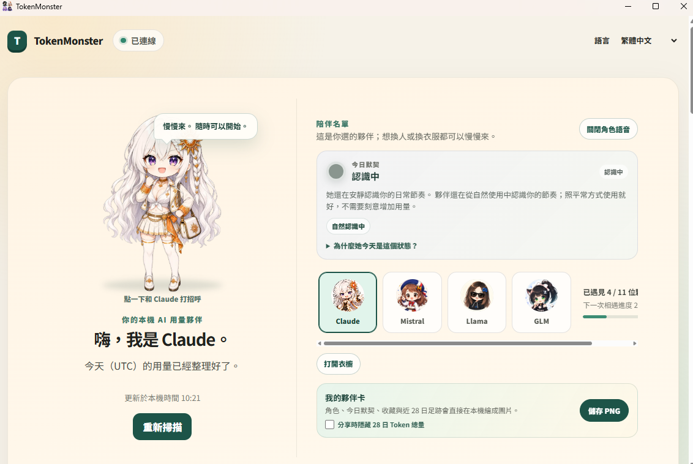
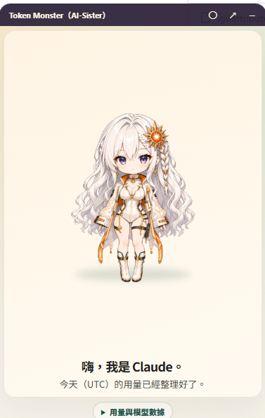
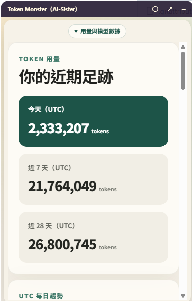
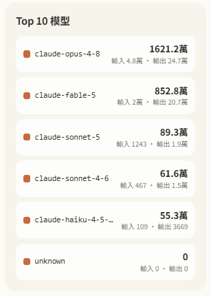
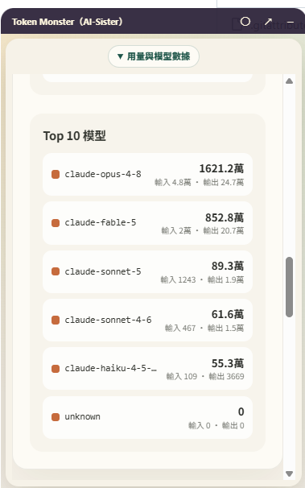

# TokenMonster

English · [繁體中文](README.md)

[](https://github.com/teddashh/TokenMonster/actions/workflows/ci.yml)
[](https://github.com/teddashh/TokenMonster/releases)
[](LICENSE)

**How many tokens did you burn today? Watch it together with your AI sisters.**

TokenMonster tracks your Claude Code, Codex, Gemini CLI, and Grok CLI token usage locally on your machine, opens a live browser dashboard, and lets eleven companion characters grow and unlock along your real usage milestones. Everything stays on your device.

## What it does

- **📊 Your AI usage at a glance** — today / 7-day / 28-day totals and a daily trend, aggregated across all four tools. Collection and deduplication run locally through an exact-pinned [TokenTracker](docs/adr/0005-permanent-tokentracker-sidecar-adapter.md) engine; one command starts everything, nothing else to install.
- **🐣 Companions that grow with you** — start by choosing one of the four sisters (ChatGPT, Claude, Gemini, Grok); lifetime totals, active-day streaks, and provider breadth unlock the seven friends (DeepSeek, Qwen, Mistral, Llama, Sakana, Perplexity, GLM) plus 20 wardrobe themes and pose art per character. Progress is earned by using, never bought.
- **🔒 Local-first privacy** — no account, no telemetry. Prompts, code, filenames, and API keys never leave your device; everything keeps working offline.
- **🖥️ Cross-platform** — Windows, macOS, Linux. Every release candidate passes CI smoke tests on all three.

## Screenshots

These screenshots come from the Windows desktop build. Characters, usage totals,
and model rankings are all generated from local data.

<p align="center">
  
  <br>
  <sub>Full desktop dashboard: character stage, daily profile, unlocked roster, and local share card.</sub>
</p>

<table>
  <tr>
    <td align="center" width="50%">
      
      <br>
      <sub>Claude desktop pet</sub>
    </td>
    <td align="center" width="50%">
      
      <br>
      <sub>Today, seven-day, and 28-day usage</sub>
    </td>
  </tr>
  <tr>
    <td align="center" width="50%">
      
      <br>
      <sub>Top 10 model ranking detail</sub>
    </td>
    <td align="center" width="50%">
      
      <br>
      <sub>Model ranking inside the pet window</sub>
    </td>
  </tr>
</table>

## Quick start

### Windows: desktop installer

1. Download the latest `TokenMonsterSetup.exe` from [Releases](https://github.com/teddashh/TokenMonster/releases) and double-click it.
2. It is an unsigned public test build for now, so SmartScreen shows a warning — click "More info → Run anyway"; a code-signed build follows once signing credentials exist.
3. TokenMonster appears in the system tray after install and launches from the Start menu afterwards; uninstall via Settings → Apps → TokenMonster.

### CLI (Windows / macOS / Linux)

Requires Node.js `24.15.0` and npm `11.12.1` (the CLI checks the exact versions to prevent unreviewed runtime drift).

1. Download the latest `tokenmonster-*.tgz` from [Releases](https://github.com/teddashh/TokenMonster/releases) (verify it with the `SHA256SUMS` file next to it).
2. Install and launch:

   ```sh
   npm install /path/to/tokenmonster-0.1.0-rc.20.tgz
   npx tokenmonster
   ```

   On Windows, run the same commands in PowerShell.

3. Open the dashboard URL it prints. On SSH / remote machines add `--no-open` and the CLI prints the matching `ssh -L` tunnel command.

Not on the npm registry yet; once published, it becomes a single `npx tokenmonster`.

To run from source:

```sh
git clone https://github.com/teddashh/TokenMonster.git tokenmonster
cd tokenmonster
npm ci
npm run build
npm exec -- tokenmonster
```

### Launch the desktop app from a repo with Codex or Claude Code

If Codex or Claude Code is already installed and authenticated, first close any
installed TokenMonster that may be running. Open this repository in the agent
and invoke the source launch explicitly:

- Codex: `$launch-tokenmonster start`
- Claude Code: `/launch-tokenmonster start`

Both entries use the same reviewed doctor, launch, and before/after audit
workflow. They do not install or modify either agent CLI, credentials, global
packages, or host tools. If the Electron native executable is absent, the
locked installer/checksums obtain only the official checksum-verified Electron
43.1.1 artifact. The result is the source-development Electron app with
the same application/runtime, normal local data, and voice authority as the
product, but it is not an installer: there is no shortcut, Add/Remove Programs
entry, or installed auto-update parity. The same skill provides `status` and
`stop` operations. See the complete
[agent-ready source-development launch contract](docs/AGENT_READY_SOURCE_RELEASE.md).

## The companions

The install ships with starter art for the four sisters and 168 fixed `zh-TW`/`en` text lines, with no audio, and works offline out of the box. The complete character-media pack (11 characters, 891 images, and 55 prerecorded WAVs; 946 entries total) downloads once from `cdn.ted-h.com` only after explicit in-app consent, then runs entirely from the verified local cache and can be repaired or removed at any time. Voice playback defaults off; removal returns to the built-in starter art and silence.

Every unlock comes from an explainable local milestone (per-family totals, lifetime total, active-day streak, provider breadth), is kept monotonically, and lives only on your machine. The product never rewards wasteful token use — no gacha, no in-app purchases, no pay-to-win.

## Privacy by design

- Collection, charts, and character progression all run locally; no cloud service is required.
- TokenMonster never stores or transmits prompts, responses, source code, filenames, project paths, API keys, or model IDs.
- Zero outbound connections by default. The only exceptions: the one-time character-pack download after your explicit consent, and the desktop pet's BYOK chat going directly from your device to the provider you chose.
- An opt-in "anonymous contribution counter" exists in the code, but it is off by default and its cloud side is not deployed — current builds send no usage data anywhere.

See the [data inventory](docs/DATA_INVENTORY.md) and [threat model](docs/THREAT_MODEL.md) for the detailed data lifecycle.

## Desktop pet

The Electron desktop build: a tray pet with drag interactions and BYOK chat (the API key lives in the OS keychain; conversations stay in memory and go straight to the provider). The Windows installer `TokenMonsterSetup.exe` is downloadable from [Releases](https://github.com/teddashh/TokenMonster/releases) today (unsigned public test build; the embedded updater is reproducibly rebuilt from source and byte-verified in the same CI run); macOS / Linux desktop builds and a code-signed installer are on the roadmap.

## Development

```sh
npm ci
npm run build
npm test
```

The full pre-commit gate (lint, typecheck, packaging verification, and more) is described in [docs/RELEASE.md](docs/RELEASE.md); architecture decisions live in [docs/adr/](docs/adr/). Any change to data shapes, collector commands, character assets, or network destinations must update the contracts, privacy regression tests, and [data inventory](docs/DATA_INVENTORY.md) together.

## Status and roadmap

- ✅ Public CLI test build — install from [Releases](https://github.com/teddashh/TokenMonster/releases), CI-smoked on all three platforms
- ✅ Windows desktop installer — unsigned public test build with a native install/boot/uninstall smoke in CI
- 🚧 Code signing (removes the SmartScreen warning)
- 🚧 npm registry publish (then it is just `npx tokenmonster`)
- 🚧 Public opt-in contribution counter (cloud side implemented, not yet deployed)

## Documentation

- [Product specification](docs/PRODUCT_SPEC.md) · [Technical specification](docs/TECHNICAL_SPEC.md)
- [Data inventory](docs/DATA_INVENTORY.md) · [Threat model](docs/THREAT_MODEL.md)
- [Release notes and process](docs/RELEASE.md) · [Deployment runbook](docs/DEPLOYMENT_RUNBOOK.md)
- [Agent-ready source-development launch](docs/AGENT_READY_SOURCE_RELEASE.md)
- [Character wardrobe map](docs/CHARACTER_WARDROBE_MAP.md) · [ADRs](docs/adr/)

## License

[MIT](LICENSE). Third-party components: see [THIRD_PARTY_NOTICES.md](THIRD_PARTY_NOTICES.md).
