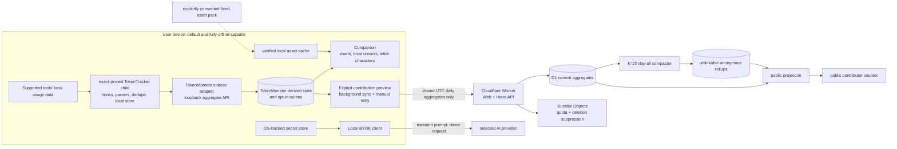

# TokenMonster

English · [繁體中文](README.md)

TokenMonster is a local-first AI usage companion. It organizes token usage on
the user's device, presents content-blind trends, and lets explainable letter
characters react to local usage milestones. A user can also preview and explicitly
opt in to contributing strictly limited UTC daily aggregates to a public
counter.

> **Current status: a testable source vertical slice, not a live service.** The
> companion, Web, API, D1, Durable Objects, `k = 20` anonymous daily compactor,
> and safe scheduled-maintenance orchestration are implemented in source. They
> do not yet have production or staging E2E evidence, and no Cloudflare account,
> D1 UUID, domain, routes, or secrets are configured. This repository must not
> be presented as a production service, public Alpha, or signed release.

> **Accepted product architecture: a permanent TokenTracker sidecar adapter.**
> TokenMonster keeps its own repository, brand, and companion. An exact-pinned
> `tokentracker-cli@0.80.0` child owns hooks, parsers, deduplication, and
> cross-platform collection; TokenMonster consumes only its loopback aggregate
> API. The target experience is one command, `npx tokenmonster`, with no
> repository clone, separate Electron install, or manually started collector.
> The sidecar source path now passes a real isolated-HOME Linux smoke from the
> source tree; that is not clean installed-package evidence for the current
> bytes. npm publication, Windows/macOS CI smoke, and legacy cutover remain
> incomplete.
> The current Tokscale/Electron collection path is a legacy source slice to be
> removed; see [ADR 0005](docs/adr/0005-permanent-tokentracker-sidecar-adapter.md).

## Core promises

TokenMonster's privacy boundary is a product requirement, not a setting to add
later.

- TokenMonster cloud never persists, logs, analyzes, or receives prompts,
  responses, source-code content, filenames, project paths, API keys, OAuth
  tokens, provider credentials, raw usage-store contents, or model IDs. It
  also never persists or logs raw HTTP request bodies.
- Local collection, charts, character derivation, fixed lines, export, and
  reset do not depend on TokenMonster cloud and must continue to work offline.
- Anonymous contribution is off by default. Only after an exact preview and
  explicit consent may the companion send closed UTC daily aggregates that
  conform to the strict schema. Hourly data, event/session counts, and the
  incomplete current day remain local.
- Public copy may only describe "tokens shared by opt-in contributors." The
  counter is neither all global AI usage nor a statistically representative
  sample.
- Character, wardrobe, and action unlocks come only from explainable local
  usage milestones and remain unlocked monotonically. The product does not
  reward wasteful token use; progression cannot be bought, and there is no
  pay-to-win mechanic.
- BYOK credentials remain in the local secret store. User-initiated chat is
  transient in companion memory and travels directly from the device to the
  selected provider; it never traverses the TokenMonster API or D1.

See the [data inventory](docs/DATA_INVENTORY.md) and
[threat model](docs/THREAT_MODEL.md) for the detailed data lifecycle.

## Local companion experience

- The companion can switch between Traditional Chinese and English. It stores
  only a content-free locale/revision beside `progressionStorePath`, so the
  choice survives changing loopback ports without cloud storage or reliance on
  browser localStorage. If private storage is unavailable, it fails closed to
  Traditional Chinese while allowing a session-only switch through fixed,
  authenticated local document routes. That route change performs a complete
  render, including already-visible chart and number formatting.
- First run exposes the collector's `starting` → `syncing` → `ready`
  phases. A successful scan without supported data is `ready-no-data`; a first
  failed scan is `refresh-failed`; a failure after a successful scan is
  `stale`, and the UI keeps showing that last local snapshot. The user can
  select "重新掃描"; the gateway shares an in-flight refresh and permits a new
  request no more often than every five seconds.
- The roster has eleven companions: the ChatGPT, Claude, Gemini, and Grok
  sisters, plus the DeepSeek, Qwen, Mistral, Venice (displayed as Llama),
  Sakana, Perplexity, and GLM friends. First run always asks the player to
  choose one of the four sisters; historical provider usage never chooses on
  the player's behalf. Existing usage can still unlock companions through
  explicit milestones, and selections saved by older releases are preserved.
- Characters unlock through explicit local milestones based on provider-family
  totals, lifetime total, active-day streak, or provider breadth. Every
  art-backed character has 20 wardrobe themes with `supported`, `challenged`,
  and `victory` pose art; GLM currently uses the built-in letter mode. Unlocks
  are local-only, monotonic, and never purchasable.
- Doll art and prerecorded voice files are not bundled in the npm package. The
  embedded fixed-pack authority, descriptor, and allowlist remain `null`, so
  CLI and Electron only verify the local cache, fall back to letter mode or
  silence, and issue zero character-asset requests. The
  `--no-character-downloads` flag remains a backward-compatible alias. This
  worktree implements explicit consent, one state-independent immutable pack,
  complete verification, offline restart, repair, and removal; the control can
  appear only after a rights-approved schema-v2 authority is embedded.
  State-selected per-object downloads remain disabled because a public object
  key could reveal the local character or wardrobe state. The schema-v1
  runtime integrity manifest already references 50 voice
  lines and the UI defaults voice off. Those rows are not public approval;
  every image and voice association still needs the schema-v2 rights gate.

With anonymous contribution left at its default off setting, the companion
does not automatically contact TokenMonster-operated infrastructure. Anonymous
UTC daily aggregates travel only after separate explicit opt-in; BYOK requests
go directly from the device to the selected provider.

## Implemented surface and release status

| Area | Current source slice | Release status |
| --- | --- | --- |
| Local companion (sidecar path) | Lightweight localhost UI, four-choice onboarding inside the compact pet, real UTC today/7/28 totals, and a daily trend | Source CLI and source-tree isolated-HOME Linux smoke pass for this post-rc.11 worktree; installed-package smoke has not been refreshed for the current bytes, and registry publication plus native Windows smoke of a fresh candidate remain |
| Collector | Exact-pinned `tokentracker-cli@0.80.0` child, local-only refresh, strict loopback adapter/gateway; the legacy slice still contains `tokscale@4.5.2` | The sidecar source slice and source-tree Linux smoke pass; a clean installed package, registry publication, Windows/macOS CI smoke, and cutover remain |
| Legacy Electron companion | Local SQLite, old 7/28-day trends, traits/fixed lines, share card, and export/reset | Migration-only; no longer the supported install or collection path, and removed or reduced to a thin shell after cutover |
| Characters | Eleven switchable characters; local starter selection and monotonic unlocks, 20 themes plus pose art and 50 prerecorded voice refs for ten characters, and GLM letter mode | Fixed-pack consent/verification/repair/removal and letter fallback are complete; the user reports GLM approval is granted, while formal evidence transcription, a non-null authority, and optional art-pack publication remain pending and do not block the letter-mode application release |
| BYOK | Companion main process calls OpenAI Responses directly with `store: false`, `background: false`, and no tools/files/conversation IDs | Implemented; a manual real-key network smoke on a safe release host remains |
| Anonymous contribution | Off by default, exact payload preview, accountless enrollment, background sync/idempotent retry, stop, delete/status/recovery | Protocol, runtime, gateway/UI controls, and conditional CLI composition are locally tested; the normal pure-Node launch remains unavailable and zero-cloud until it has an audited native OS credential host, and staging/cloud-off packet-capture E2E remain |
| Web/API | zh-TW-first React/Vite SPA, Hono Worker API, public totals, enrollment/ingest/delete/status | Implemented, built, and fail-closed in dry-run; no remote environment is configured |
| Cloud data | Guarded D1 mutations, deletion, projection, retention, Durable Object rate limits/suppression | Implemented and locally tested; real D1 migrations, capacity, and failure rehearsals remain |
| Anonymous compaction | Complete UTC-day `day-all-v1`, `k = 20` gate, mapping-free rollups, commit-time race guards | Implemented and locally tested; no staging/production E2E yet |
| Scheduled maintenance | Deletion → compaction → retention → projection; retention preserves compaction-owned input to prevent partial-day loss | Implemented and locally tested; not yet verified against real Cron Triggers/D1 |
| Installers/update feed | Internal unsigned Linux/macOS ASAR/ZIP can be produced and inspected; Windows release tooling strictly binds `RELEASES` to one full `.nupkg` and emits a deterministic `latest`/`next` promotion plan | Not a public installer; signing, notarization, DMG, Squirrel current-channel retrieval/credentialed deployment/public readback, and native install-update smoke remain STOP gates |

## Accepted target architecture



TokenTracker is the sole collection and deduplication authority; TokenMonster
does not read its raw queue, database, or private code. The cloud path accepts
only coarse daily aggregates from a versioned contract and never receives the
upstream store, a provider key, or conversation content.

## Repository layout

```text
apps/
  companion/        Retiring legacy Electron UI and local host composition
  web/              React/Vite public UI and Cloudflare Worker entry
  api/              Portable HTTP and fail-closed Cloudflare compositions
packages/
  cli/              `tokenmonster` entry point and lifecycle composition
  companion-ui/     Lightweight localhost character, real totals, daily trend
  companion-gateway/ Loopback session, fixed assets/API, DTO projection
  contribution-runtime/ Opt-in lifecycle, outbox, pause/delete, daily projection
  token-tracker-runtime/ Exact-pinned child and local-only refresh lifecycle
  token-tracker-adapter/ Sole upstream aggregate API boundary
  contracts/        Versioned strict schemas shared by local and cloud code
  usage-domain/     Content-blind usage normalization and domain rules
  collector-core/   Legacy migration-only scheduling and scan evidence
  collector-tokscale/ Legacy migration-only Tokscale adapter
  local-store/      Local SQLite, revisions, outbox, reset/export boundaries
  monster-engine/   Deterministic, explainable trait derivation
  characters/       Catalog, fixed lines, placeholders, asset release gate
  secret-vault/     Electron safeStorage boundary
  byok-openai/      Local direct OpenAI Responses adapter
  api-domain/       Framework-free enrollment, ingest, and delete/status domain
  api-cloudflare/   Cloudflare auth, quota, and suppression adapters
  cloud-d1/         D1 schema, guarded mutations, compaction, retention,
                    and projection
docs/               Product/technical specs, runbook, threat model, ADRs,
                    and release checklist
scripts/            Repository, secret, build, and release artifact verifiers
```

The dependency direction is `apps → adapters → domain/contracts`. Domain
packages must not import Electron, Hono, D1, or UI frameworks.

## Prerequisites

- Node.js `24.15.0`
- npm `11.12.1`
- Git
- The public CLI and repository gates both require Node.js `24.15.0` exactly;
  release smoke rejects other versions to prevent unreviewed runtime drift
- Only legacy Tokscale/Electron packaging tests still require `bubblewrap`,
  `strace`, or `sandbox-exec`
- Cloudflare remote operations: Wrangler and an owner-approved
  account/environment; local builds and dry-runs do not need production
  credentials

The legacy Tokscale collector remains unsupported on Windows. The TokenTracker
sidecar is the Windows/macOS/Linux target, but full cross-platform CI smoke has
not passed yet; the Linux smoke is not a public cross-platform release claim.

## Install and develop locally

The release target is `npx tokenmonster`. The package is not published to the
npm registry yet; run the same CLI composition from this repository for now:

```sh
git clone https://github.com/teddashh/TokenMonster.git tokenmonster
cd tokenmonster
npm ci
npm run build --workspace @tokenmonster/monster-engine
npm run build --workspace @tokenmonster/characters
npm run build --workspace @tokenmonster/token-tracker-adapter
npm run build --workspace @tokenmonster/token-tracker-runtime
npm run build --workspace @tokenmonster/companion-gateway
npm run build --workspace @tokenmonster/companion-ui
npm run build --workspace tokenmonster
npm exec -- tokenmonster --no-open
```

`--no-open` is intended for SSH/headless machines and prints a one-use URL plus
the matching `ssh -L` command. Omit it on a local desktop. This path uses the
TokenTracker collector bundled as an exact dependency; users do not clone or
start the TokenTracker repository separately.

Character assets are unconditionally cache-only: the gateway accepts only a
null CDN origin and exposes no network fetch hook or per-object downloader.
`--no-character-downloads` is retained for backward compatibility. The
companion revalidates and reads only `~/.tokenmonster/asset-cache`, falling back
to the built-in letter renderer or silence when an object is absent;
collection, charts, and local unlock progress are unaffected.

The Web/Electron commands below belong to the public site or legacy migration
slice; they are not the new companion launch path.

Start the Web UI's Vite development server:

```sh
npm run dev --workspace @tokenmonster/web
```

Without a `TOKENMONSTER_DB` binding, public totals intentionally return a
sanitized `503`. The UI never substitutes demo or fabricated totals.

Start the companion renderer development server:

```sh
npm run dev --workspace @tokenmonster/companion
```

Build and start the complete Electron companion:

```sh
npm run build --workspace @tokenmonster/companion
npm run start --workspace @tokenmonster/companion
```

If Chromium sandbox/AppArmor requirements are not met on the current Linux
host, launch must fail closed. Move the smoke test to a correctly isolated host
instead of adding `--no-sandbox`.

## Verify, test, and build

Run the complete local pre-commit gate:

```sh
npm run format:check
npm run lint
npm run verify:secrets
npm run typecheck
npm test
npm run build
npm run verify:packaging-toolchain
npm run verify:artifacts
npm audit --audit-level=high
```

Use npm's workspace flag for a focused check, for example:

```sh
npm test --workspace @tokenmonster/cloud-d1
npm run typecheck --workspace @tokenmonster/collector-tokscale
npm run build --workspace @tokenmonster/web
```

### Worker dry-run

This validates the build and bundle without creating or changing remote
resources:

```sh
cd apps/web
npx wrangler deploy --dry-run --outdir .wrangler/dry-run
cd ../..
```

A successful dry-run does not mean staging or production is deployable. The
checked-in Wrangler config intentionally has no D1 UUID, custom domain, routes,
environment secrets, or mutation enable flag. Cloud writes must fail closed
whenever a required binding is missing.

### Internal companion package

```sh
npm run make:companion:internal
npm run verify:companion-package
```

This produces and audits an unsigned internal ASAR/ZIP only. Generated output
and evidence are not committed. It is not a signed/notarized installer and does
not constitute an Alpha release.

## Anonymous contribution flow

1. The user first sees an exact local payload preview. There is no enrollment
   or upload without explicit consent.
2. Only closed UTC dates with complete-scan evidence for all four collector
   scopes and complete day coverage can enter a candidate payload. Today,
   partial days, hourly data, raw events, and conversation content are
   ineligible.
3. Enrollment and upload accept only reviewed HTTPS origins, and all
   contribution credential slots require OS-backed safe storage. An insecure
   Linux `basic_text` backend cannot opt in.
4. After explicit opt-in, a main-process one-shot timer schedules background
   sync after startup, wake, and a completed local scan. It makes no request
   when no payload is due. Retries reuse the exact body and `batchId`; manual
   retry remains available, and absolute revisions let a missing key become a
   higher-revision zero correction.
5. Stop removes upload authority and the local outbox while retaining separate
   deletion authority. Delete and status use distinct credential lifecycles.
6. Cloud compacts only a complete expired day into `day-all-v1`. At least 20
   eligible contributors are required before a mapping-free coarse rollup is
   written. Below-threshold expired attributable rows are deleted as a whole
   day and never exposed as a small cohort.

The permanent loopback controls and CLI runtime composition are implemented,
but the normal pure-Node entry point intentionally injects no contribution
credential authority yet. Its status is therefore unavailable/default-off and
it performs zero contribution-cloud work. A platform release must provide and
audit a native OS credential host before those controls can enable sharing;
plaintext, memory-only, or environment-variable fallback is forbidden.

Important limitation: the scheduler currently has local fake-timer and service
tests only. Staging packet capture, retry/out-of-order E2E, and real-D1
compaction/retention race rehearsals remain pending.

The companion cloud origin is supplied through `TOKENMONSTER_API_BASE_URL` and
must exactly match a compiled HTTPS allowlist. Never place production secrets
in `.env`, the repository, logs, screenshots, or release evidence.

## BYOK boundary

The current optional BYOK path calls the OpenAI Responses API directly from the
Electron main process:

- The API key prefers OS-backed Electron `safeStorage`; an insecure or
  unavailable backend permits a RAM-only session and does not write the key to
  disk.
- Prompts/responses stay in bounded memory and are cleared on character change,
  key removal, window close, and process shutdown.
- Requests explicitly use `store: false` and `background: false`, with files,
  tools, hosted search, conversation IDs, and redirects disabled.
- The TokenMonster Worker, D1, analytics, and public API never receive provider
  credentials or BYOK conversation content.

BYOK still sends content directly to the provider selected by the user and is
subject to that provider's terms and data policies. TokenMonster must not
describe this direct path as "content never leaves the device."

## Cloud configuration and deployment

Follow the [deployment runbook](docs/DEPLOYMENT_RUNBOOK.md) for every remote
deployment. Critical bindings/settings include `TOKENMONSTER_DB`, separate
Durable Object namespaces, `TOKENMONSTER_MUTATIONS_ENABLED`, credential/rate-key
secret configuration, and the exact allowed public origin. Actual names, UUIDs,
routes, and secret values belong to the environment and must not be committed.

Production and staging are both **STOP**. At minimum, the following gates remain:

- owner-approved Cloudflare account, D1 Paid, isolated dev/staging/production
  environments, D1 UUIDs, custom domains, routes, secrets, and reviewed origins;
- real Wrangler D1 migrations plus staging E2E for API/Cron/Durable Objects/
  `k = 20` compaction, load/SLO tests, and failure-injection evidence;
- staging packet-capture, sleep/wake, and long-running retry-soak evidence for
  the companion background contribution scheduler;
- signed/notarized installers, nested-native/DMG/updater verification, and
  native packaged smoke on supported platforms;
- encrypted logical backups, deletion-suppression replay, restore-from-zero,
  and rollback drills;
- privacy/terms/legal review, a project-license decision, and third-party
  redistribution review;
- a separate schema-v2 rights/brand/content gate for the existing 50 voice refs
  and any future voice packs; schema-v1 runtime rows are not public approval.

Until every gate has reproducible evidence, do not create production D1 state,
enable mutations, publish a download link, or call this project live.

## Collector and character sources

The permanent collection authority is an exact-pinned `tokentracker-cli` child
process; the migration baseline is `0.80.0`. TokenMonster owns only child
lifecycle, the version handshake, and a strict loopback aggregate adapter. It
does not fork, vendor, submodule, deep-import, or read the upstream queue or
database, and it does not depend on an upstream dashboard plugin. A bot opens
version-update PRs, which merge only after cross-platform contract, privacy,
and one-command smoke tests pass.

The current `tokscale@4.5.2` path and collector fork are not long-term runtime
inputs and receive no new product work. They are removed after sidecar cutover;
the two sources must never cover or be summed for the same time window during
migration.

AI-Sister/`multi-ai-chat-app` is the design and persona source, but it is not a
TokenMonster runtime dependency. The release-embedded schema-v1 integrity
manifest lists immutable hash-named output for ten characters, each with 20
themes and poses. GLM has no matching art bundle and therefore stays in
TokenMonster-owned letter mode. Release entry points display only reverified
local-cache objects; usage-selected lazy fetch is disabled. Raw parts,
generation tools, prompts, and publisher credentials never enter TokenMonster. See the
[character wardrobe map](docs/CHARACTER_WARDROBE_MAP.md).

## Documentation

- [Product specification](docs/PRODUCT_SPEC.md)
- [Technical specification](docs/TECHNICAL_SPEC.md)
- [Implementation and launch plan](docs/IMPLEMENTATION_PLAN.md)
- [Deployment runbook](docs/DEPLOYMENT_RUNBOOK.md)
- [Private Alpha release checklist](docs/ALPHA_RELEASE_CHECKLIST.md)
- [Data inventory](docs/DATA_INVENTORY.md)
- [Threat model](docs/THREAT_MODEL.md)
- [Character wardrobe map](docs/CHARACTER_WARDROBE_MAP.md)
- [ADR 0001: repository boundaries](docs/adr/0001-repository-boundaries.md)
- [ADR 0002: runtime and deployment](docs/adr/0002-runtime-and-deployment.md)
- [ADR 0003: D1 atomic mutation adapter](docs/adr/0003-d1-atomic-mutation-adapter.md)
- [ADR 0004: Electron packaging and signing](docs/adr/0004-electron-packaging-and-signing.md)
- [ADR 0005: permanent TokenTracker sidecar adapter](docs/adr/0005-permanent-tokentracker-sidecar-adapter.md)
- [Third-party notices](THIRD_PARTY_NOTICES.md)

## Contributing

This is a private, pre-release repository. Any change to a data shape,
collector command, character asset, network destination, credential lifecycle,
or retention behavior must update contracts, privacy regression tests, the data
inventory, threat model, and release checklist together. Never add prompts,
responses, paths, filenames, raw model labels, keys, or real-user fixtures to
tests, logs, analytics, or issue attachments.

## License

The project license is pending, and this repository currently grants no public
use or redistribution permission. Third-party components remain subject to
their respective licenses; see [THIRD_PARTY_NOTICES.md](THIRD_PARTY_NOTICES.md).
Until legal/rights review and an explicit license file are complete, this
project is for internal development and evaluation only.
