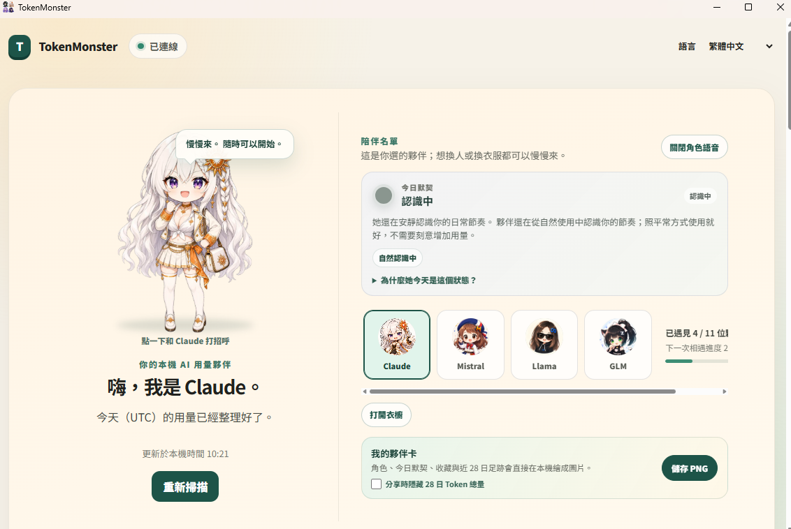
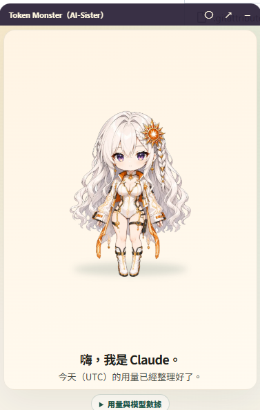
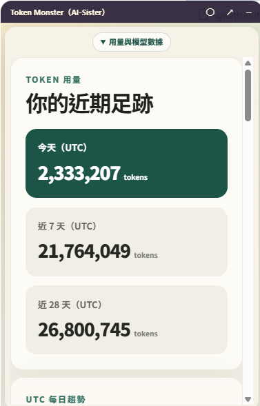
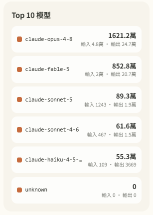
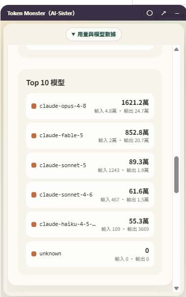

# TokenMonster

**English** · [繁體中文](README.md)

Tracks Claude Code, Codex, Gemini CLI, and Grok Build token usage on your own machine, and unlocks eleven companion characters from real usage milestones.

**Project page:** https://teddashh.github.io/TokenMonster/

[](https://github.com/teddashh/TokenMonster/actions/workflows/ci.yml)
[](https://github.com/teddashh/TokenMonster/releases)
[](LICENSE)

**How many tokens did you burn today? Watch it together with your AI sisters.**

TokenMonster runs an exact-pinned [TokenTracker](https://github.com/mm7894215/TokenTracker) sidecar that reads the usage records your CLIs already keep on your machine, turns them into a live dashboard, and lets companion characters grow and unlock along your real usage milestones. No account, no telemetry, and the data stays on your device.

Current state: public test build (v0.1.0-rc.22, July 2026). Windows has a desktop installer; the CLI runs on Windows, macOS, and Linux.

## What it does

- **Your AI usage at a glance**: today, 7-day, and 28-day totals, a daily UTC trend, a per-provider breakdown, a Top 10 model list, and a remaining-quota estimate for the plan you pick (community figures, not official limits). Collection and deduplication run locally in the pinned TokenTracker (`tokentracker-cli@0.80.0`), which is installed along with TokenMonster.
- **Companions that grow with you**: draw a card for your first sister or pick ChatGPT, Claude, Gemini, or Grok yourself, and switch any time without spending tokens. Seven friends (DeepSeek, Qwen, Mistral, Llama, Sakana, Perplexity, GLM) unlock from provider totals, lifetime totals, active-day streaks, and how many providers you use. Every character has 20 outfit themes and pose art. Progress is earned by using, never bought.
- **Today's connection and the companion card**: a daily read of your usage rhythm over the last 28 days. While it is still learning, it says so and tells you there is no need to use more. Your character, today's connection, and your collection can be drawn locally into a PNG, with the option to hide the 28-day token total.
- **Local-first**: collection, charts, and character progress all happen on your machine and keep working offline. Nothing leaves it unless you take an action; see Privacy by design below.
- **Desktop app and CLI**: the Windows desktop app has a tray pet and the full dashboard; the CLI opens the same dashboard in your browser. The interface comes in Traditional Chinese and English.

## Screenshots

These screenshots come from the Windows desktop build. Characters, usage totals,
and model rankings are all generated from local data.

<p align="center">
  
  <br>
  <sub>Full desktop dashboard: character stage, daily profile, unlocked roster, and local share card.</sub>
</p>

<table>
  <tr>
    <td align="center" width="50%">
      
      <br>
      <sub>Claude desktop pet</sub>
    </td>
    <td align="center" width="50%">
      
      <br>
      <sub>Today, seven-day, and 28-day usage</sub>
    </td>
  </tr>
  <tr>
    <td align="center" width="50%">
      
      <br>
      <sub>Top 10 model ranking detail</sub>
    </td>
    <td align="center" width="50%">
      
      <br>
      <sub>Model ranking inside the pet window</sub>
    </td>
  </tr>
</table>

## Quick start

### Windows: desktop installer

1. Download the latest `TokenMonsterSetup.exe` (currently v0.1.0-rc.22) from [Releases](https://github.com/teddashh/TokenMonster/releases) and double-click it.
2. It is an unsigned public test build, so SmartScreen shows a warning: click "More info", then "Run anyway". A code-signed build follows once signing credentials exist.
3. TokenMonster appears in the system tray after install and launches from the Start menu afterwards. Uninstall it from Settings → Apps → TokenMonster.
4. Automatic update checks are off by default. When checked on 2026-10-01, the built-in update feed had no content yet (it returned 404), so get new versions from Releases.

### CLI (Windows / macOS / Linux)

Requires exactly Node.js `24.15.0` and npm `11.12.1`. The package declares both in `engines`; other versions are unsupported.

1. Download `tokenmonster-0.1.0-rc.22.tgz` from [Releases](https://github.com/teddashh/TokenMonster/releases) and check it against `TokenMonster-cli-SHA256SUMS.txt` from the same release.
2. Install it into its own folder and launch it (on Windows, run the same commands in PowerShell):

   ```sh
   mkdir tokenmonster-app
   cd tokenmonster-app
   npm install /path/to/tokenmonster-0.1.0-rc.22.tgz
   npx tokenmonster
   ```

   Do not use `npm install -g` on the tarball: npm's global install of bundled dependencies breaks the install script of the sidecar's `@mongodb-js/zstd`. The install fetches only `tokentracker-cli` and its dependencies from the npm registry, pinned by the shrinkwrap embedded in the release.

3. The CLI prints a one-time local URL and opens your browser. On SSH or remote machines, add `--no-open` and the CLI prints the matching `ssh -L` tunnel command; run it on your own computer, then open the printed URL. With `--no-character-downloads`, that run does not offer the character media pack download.

TokenMonster is not on the npm registry yet.

### From source

Same requirements: the root `package.json` pins Node.js 24.15.0 and npm 11.12.1 with `engine-strict`, so `npm ci` rejects other versions.

```sh
git clone https://github.com/teddashh/TokenMonster.git
cd TokenMonster
npm ci
npm run build
npm exec -- tokenmonster
```

On Windows, do not run the full `npm run build` at the root: the Electron app's vite build currently fails there. Use `node scripts/run-workspaces.mjs build tokenmonster` instead, which builds only the workspaces the CLI needs.

### Launch the desktop app from a clone with Codex or Claude Code

If Codex or Claude Code is installed and signed in, you can start the desktop app straight from a clone of this repository. Close any installed TokenMonster that may be running, open the repository in the agent, and ask explicitly:

- Codex: `$launch-tokenmonster start`
- Claude Code: `/launch-tokenmonster start`

Both run the same workflow: an audit before and after, a doctor check, then the launch. The same skill also provides `status` and `stop`. It does not install or modify the agent CLIs, credentials, global packages, or host tools; if the Electron executable is missing, it fetches only the official Electron 43.7.7 build, checked against locked checksums. What runs is the source-development app, with the same application, local data, and voice settings as the product, but it is not an installation: no shortcut, no Add/Remove Programs entry, and no auto-update. See the full [agent-ready source-development launch contract](docs/AGENT_READY_SOURCE_RELEASE.md).

## The companions

| Character | Kind | Unlocks at |
| --- | --- | --- |
| ChatGPT | sister | the first Codex token, or picking her at the first meeting |
| Claude | sister | the first Claude Code token, or picking her at the first meeting |
| Gemini | sister | the first Gemini CLI token, or picking her at the first meeting |
| Grok | sister | the first Grok Build token, or picking her at the first meeting |
| DeepSeek | friend | 100,000 DeepSeek tokens |
| Qwen | friend | 250,000 Qwen tokens |
| Mistral | friend | a 3-day active streak |
| Llama | friend | 500,000 lifetime tokens |
| Sakana | friend | 4 different providers used |
| Perplexity | friend | a 7-day active streak |
| GLM | friend | 5,000,000 lifetime tokens |

Once a character unlocks, its 20 outfit themes open as that provider's total grows. GLM is the exception: its outfits follow lifetime totals (5,000,000 to 30,000,000 tokens), because TokenTracker 0.80.0 does not report GLM usage separately. Active-day streaks also open victory poses and actions.

The install ships starter art for the four sisters (8 WebP images) and 168 fixed `zh-TW`/`en` text lines, with no audio, and works offline out of the box. The complete character media pack (`ai-sister-media-11-voice55-2026.07.23`: 11 characters, 891 images, and 55 prerecorded voice clips; 946 entries, about 73 MB) downloads once from `cdn.ted-h.com` only after explicit in-app consent. Every file is checked against its SHA-256 digest before it enters the local cache, which then runs fully offline and can be repaired or removed at any time. Voice playback is off by default; removing the pack returns to the built-in starter art and silence.

Every unlock comes from an explainable local milestone, is never taken back, and lives only on your machine. Tokens are measurements, not game currency: no paid draws, no in-app purchases, no pay-to-win, and the lines never encourage wasting tokens.

The character art and voices are not covered by the MIT License; see [THIRD_PARTY_NOTICES.md](THIRD_PARTY_NOTICES.md) for the terms.

## Privacy by design

- Collection, charts, and character progress all run locally, with no account or cloud service. The TokenTracker sidecar starts with `TOKENTRACKER_NO_TELEMETRY=1` and `DO_NOT_TRACK=1`, an allowlisted environment, and a preloaded module that blocks outbound network calls and child processes.
- TokenMonster keeps only aggregate counts. Raw usage JSON is parsed in memory and discarded. Prompts, responses, source code, file names, paths, raw model IDs, API keys, and cookies are kept out of logs, share cards, diagnostic bundles, and any contribution; model names appear only in the local dashboard's Top 10 list.
- No outbound connections by default. TokenMonster connects out only when you take an action:
  - the one-time character pack download after your consent (`cdn.ted-h.com`);
  - BYOK chat in the desktop app, sent straight from your machine to OpenAI (`https://api.openai.com/v1/responses` with `store: false`), with no TokenMonster server in between;
  - the Windows update check, which contacts the fixed built-in update feed only when you press the manual check or turn automatic checks on.
- An opt-in "anonymous contribution counter" exists in the code, but it is off by default and its service is not deployed, so current builds send no usage data anywhere.

See the [data inventory](docs/DATA_INVENTORY.md) and [threat model](docs/THREAT_MODEL.md) for the detailed data lifecycle.

## Desktop pet

The Electron 43.7.7 desktop build (Windows only for now): a pet window you can drag, pin on top, or hide to the tray, with usage and the Top 10 model list folded out below the character. The tray menu opens the full dashboard.

BYOK chat supports OpenAI only (model `gpt-5.6-luna`). The API key is encrypted with Electron `safeStorage`, or you can keep it in memory only; conversations live only in memory and clear when closed.

The Windows installer `TokenMonsterSetup.exe` is packaged with Squirrel.Windows and available from [Releases](https://github.com/teddashh/TokenMonster/releases). It is an unsigned public test build; the embedded updater is rebuilt from source and byte-verified in the same CI run. macOS and Linux desktop builds and a code-signed installer are on the roadmap.

## Development

```sh
npm ci
npm run build
npm test
```

`npm test` runs `npm run agent:verify` first, then every workspace's tests. On Windows, build as described in From source above. The full pre-commit gate (lint, typecheck, packaging verification, and more) is described in [docs/RELEASE.md](docs/RELEASE.md); architecture decisions live in [docs/adr/](docs/adr/). Any change to data shapes, collector commands, character assets, or network destinations must update the contracts, privacy regression tests, and [data inventory](docs/DATA_INVENTORY.md) together.

On a machine with no real usage, the dashboard shows an honest empty state and every character stays locked. To try unlocks, outfits, and voice anyway, run `node scripts/qa/seed-demo-store.mjs` after building and before the first launch; it writes a demo progression store and refuses to touch an existing one. Delete `~/.tokenmonster` to reset.

## Status and roadmap

Done:

- Public CLI test build (v0.1.0-rc.22), installed from [Releases](https://github.com/teddashh/TokenMonster/releases); the rc.22 release smoke test passed on Linux, macOS, and Windows.
- Windows desktop installer: an unsigned public test build that CI installs, launches, and uninstalls.

Not yet:

- Code signing (removes the SmartScreen warning)
- Publishing to the npm registry
- macOS and Linux desktop builds
- A live Windows update feed
- The public opt-in contribution counter (service implemented, not deployed)

On main (`d357cf7`), every CI job passes except Verify, which stops only at the complete dependency audit step. That audit still reports 5 high findings, all in packaging tools: `extract-zip` through `@electron/packager` 18, and `image-size` through `electron-installer-dmg` and `appdmg`. Clearing them needs a major upgrade of `@electron/packager` and an override or replacement for the DMG tooling, because the latest `appdmg` still depends on a vulnerable `image-size` range. The audit of shipped dependencies (`npm audit --omit=dev`) passes.

## Documentation

- [Product specification](docs/PRODUCT_SPEC.md) · [Technical specification](docs/TECHNICAL_SPEC.md)
- [Data inventory](docs/DATA_INVENTORY.md) · [Threat model](docs/THREAT_MODEL.md)
- [Release notes and process](docs/RELEASE.md) · [Deployment runbook](docs/DEPLOYMENT_RUNBOOK.md)
- [Agent-ready source-development launch](docs/AGENT_READY_SOURCE_RELEASE.md)
- [Character wardrobe map](docs/CHARACTER_WARDROBE_MAP.md) · [ADRs](docs/adr/)

## Credits

- [TokenTracker](https://github.com/mm7894215/TokenTracker) (MIT): the collection engine. TokenMonster pins `tokentracker-cli@0.80.0` exactly and runs it as a sidecar, without forking or modifying it; see [ADR 0005](docs/adr/0005-permanent-tokentracker-sidecar-adapter.md).
- [tokscale](https://github.com/junhoyeo/tokscale) (MIT): the earlier collector, now used only to migrate legacy data.
- [Squirrel.Windows](https://github.com/Squirrel/Squirrel.Windows): the Windows installer and updater.
- `@mongodb-js/zstd` (Apache-2.0) with Zstandard (BSD), and `yauzl` and `pend` (MIT).
- [token-monitor](https://github.com/Javis603/token-monitor) and [ai-avatar-bot](https://github.com/YuriCrystal/ai-avatar-bot): architecture and interaction references only; no code was imported.

See [THIRD_PARTY_NOTICES.md](THIRD_PARTY_NOTICES.md) for the full list and license terms.

Related: [AI-Sister](https://teddashh.github.io/AI-Sister/) is a later local-first desktop companion that reuses TokenMonster's pet-window approach and the same character media pack.

## License

[MIT](LICENSE) © 2026 Ted Huang. The character art and voices are not covered by the MIT License; third-party components and character media terms are in [THIRD_PARTY_NOTICES.md](THIRD_PARTY_NOTICES.md).
