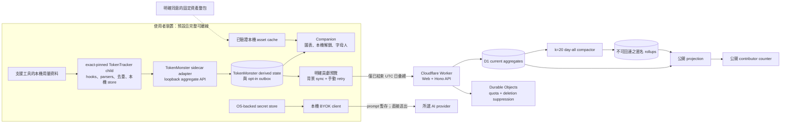

# TokenMonster

[English](README.en.md) · 繁體中文

TokenMonster 是一個 local-first 的 AI 使用量夥伴：它在本機整理 token
用量、呈現內容不可知的趨勢，並讓可解釋的角色依本機使用里程碑產生互動。使用者也可在
明確預覽與同意後，選擇把嚴格限縮的 UTC 每日彙總貢獻給公開計數器。

> **目前狀態：可測試的 source vertical slice，尚未上線。** Companion、Web、API、
> D1、Durable Objects、`k = 20` 匿名日彙整與安全的 scheduled maintenance
> 編排已在原始碼中實作；但還沒有 production／staging E2E 證據，也沒有配置
> Cloudflare account、D1 UUID、domain、routes 或 secrets。此 repository
> 不應被描述成 production service、公開 Alpha 或已簽署的發行版。

> **已接受的產品架構：永久採用 TokenTracker sidecar adapter。** TokenMonster
> 維持自己的 repository、品牌與 companion；exact-pinned
> `tokentracker-cli@0.80.0` 子程序負責 hooks、parsers、去重與跨平台收集，TokenMonster
> 只透過 loopback aggregate API 取用資料。目標使用方式是單一指令
> `npx tokenmonster`，不需要 clone repository、另裝 Electron 或手動啟動 collector。
> 歷史 `0.1.0-rc.12` exact tarball 曾在空 prefix 安裝，並以隔離 HOME 完成真實
> Linux installed smoke；系統層 trace 只出現 loopback socket，沒有外部目的地。
> 後續 credential-host hardening 已淘汰該候選，禁止補測、重標或發布那些 bytes。
> 下一個唯一版本仍須重做 clean install、Windows／macOS smoke、registry gate 與
> legacy cutover。目前的 Tokscale／Electron
> 收集鏈是待移除的 legacy source slice，詳見
> [ADR 0005](docs/adr/0005-permanent-tokentracker-sidecar-adapter.md)。

## 核心承諾

TokenMonster 的隱私邊界是產品需求，不是日後才補上的設定。

- 永遠不保存、記錄、分析或送到 TokenMonster cloud：prompt、response、原始碼內容、
  filename、project path、API key、OAuth token、provider credential、原始使用量
  store 內容或 model ID；cloud 也不保存或記錄原始 HTTP request body。
- 本機收集、圖表、角色推導、固定台詞、匯出與重設，不需要 TokenMonster cloud；
  cloud 關閉或離線時仍應可用。
- 匿名貢獻預設關閉。只有使用者明確預覽並同意後，才會傳送嚴格 schema 的已結束
  UTC 日彙總；hourly 資料、event/session count 與今日未完整資料只留在本機。
- 公開數字只能稱為「選擇加入之貢獻者分享的 tokens」；它不是全世界的 AI 用量，
  也不是具統計代表性的樣本。
- 角色、衣櫥與動作解鎖只來自可說明的本機使用里程碑，而且單向保留；產品不獎勵
  浪費 token，進度無法購買，也沒有 pay-to-win。
- BYOK key 留在本機 secret store。使用者主動發出的聊天內容只會暫存在 companion
  記憶體，並由本機直接送往所選 provider；它不會經過 TokenMonster API 或 D1。

詳細資料生命週期請閱讀 [Data inventory](docs/DATA_INVENTORY.md) 與
[Threat model](docs/THREAT_MODEL.md)。

## 本機 companion 體驗

- Companion 可在繁體中文與英文間切換；選擇只以內容不可知的 locale/revision
  保存在 `progressionStorePath` 同一個私有本機目錄，因此 loopback port 改變後仍會保留，
  不使用 cloud 或僅靠瀏覽器 localStorage。儲存不可用時維持 fail-closed 的繁中預設，
  當次視窗仍可透過固定、需 session 的本機文件路徑暫時切換並完整重繪，既有圖表數字
  也不會殘留前一個語系的格式。
- 首次啟動會清楚顯示 collector 的 `starting` → `syncing` → `ready` 狀態。掃描完成但
  還沒有支援資料時是 `ready-no-data`；首次掃描失敗是 `refresh-failed`；已有上次成功資料時
  則是 `stale`，並繼續顯示該份本機快照。使用者可按「重新掃描」；gateway 會共用進行中的
  refresh，並將新請求限制為至少間隔 5 秒。
- 陪伴名單共 11 位：ChatGPT、Claude、Gemini、Grok 四位姊妹，以及 DeepSeek、
  Qwen、Mistral、Venice（UI 顯示 Llama）、Sakana、Perplexity 與 GLM 七位朋友。
  第一次一律由玩家從四位姊妹中選擇，不會因電腦上已有哪一家 provider 的歷史用量
  就替玩家決定。既有用量仍可照明確里程碑解鎖角色，已從舊版保存的選擇也會保留。
- 角色依 provider family 累積量、總用量、活躍日連續或 provider 廣度等明確的本機里程碑
  解鎖。11 位角色都有核准的 avatar、20 種衣櫥主題與 `supported`、`challenged`、
  `victory` pose art。所有解鎖都只存在本機、單向保留且不可購買。
- Release staging 會在候選 npm tarball 中加入精確 8 個已核准 WebP，共 415,470 bytes：
  ChatGPT、Claude、Gemini、Grok 各一張 avatar 與一張 `tech` 基本服裝。四位元祖角色另有
  4 × 7 triggers × 3 variants × 2 locales，共 168 條內建 `zh-TW`／`en` 固定文字；tarball
  不含 WAV 或其他角色語音。這些基本圖文不需 runtime 下載，乾淨安裝、未同意完整包、
  離線無完整 cache、完整包失敗或撤銷時都維持零次素材 GET。四位以內建基本圖文運作，
  其他缺圖狀態才回退到字母模式／靜音。使用者明確啟用後，只會從
  `https://cdn.ted-h.com` 下載一次與本機角色、解鎖、衣裝、pose、trigger 或 usage 無關的
  65,574,180-byte 固定整包；完整驗證後可離線使用、修復或移除，移除後回到內建基本圖文。
  `ai-sister-images-11-2026.07.21` 只含 891 張圖片、11 位角色與 0 條語音；歷史 50 條
  cloned WAV 雖已有 owner approval 私有憑證，仍因 clone consent/provenance、逐條 content
  review 與 metadata 清理證據不足而排除，必須另做新的 image + voice 合併 immutable
  release。先前按解鎖狀態逐物件下載的設計維持停用，避免 object key 洩漏本機狀態。

在預設未加入匿名貢獻的情況下，companion 不會主動連到 TokenMonster 營運基礎設施。
匿名 UTC 日彙總仍只會在另行明確 opt in 後傳送；BYOK 請求則由本機直接連到使用者選定的
provider。

## 現有功能與發行狀態

| 區域                            | 目前 source slice                                                                                                                                                                                                                  | 上線前狀態                                                                                                                                                                                                                                                            |
| ------------------------------- | ---------------------------------------------------------------------------------------------------------------------------------------------------------------------------------------------------------------------------------- | --------------------------------------------------------------------------------------------------------------------------------------------------------------------------------------------------------------------------------------------------------------------- |
| Local companion（sidecar path） | 輕量 localhost UI、compact pet 內的四選一起始流程、真實 UTC 今日／7／28 日 totals 與每日趨勢                                                                                                                                       | 已淘汰的 rc.12 bytes 留有 clean Linux installed smoke 與 loopback-only trace 歷史證據；post-hardening 的新版本仍須重做 clean install、registry gate 與原生 Windows／macOS smoke                                                                                       |
| Collector                       | exact-pinned `tokentracker-cli@0.80.0` child、local-only refresh、strict loopback adapter／gateway；legacy slice 仍含 `tokscale@4.5.2`                                                                                             | 歷史 rc.12 安裝包曾驗證 exact 41-package sidecar closure 與 Linux zstd prebuild；下一個唯一版本須重做 closure、registry、Windows／macOS CI smoke 與 cutover 證據                                                                                                      |
| Legacy Electron companion       | 本機 SQLite、舊 7／28 日趨勢、traits／固定台詞、share card、export／reset                                                                                                                                                          | Migration-only；不再作為支援的安裝或 collection 路徑，sidecar cutover 後移除或降為 thin shell                                                                                                                                                                         |
| Characters                      | 11 位可切換角色；四位元祖各有 release-only avatar＋`tech` 基本服裝與 168 條雙語文字，另有 11 位的完整 avatar、20 種衣櫥與 pose art；內嵌語音仍為 0                                                                                     | 8 個基本 WebP（415,470 bytes）在候選 tarball 內零 GET 使用；891-image／65,574,180-byte 固定整包已公開並完成 immutable readback，但仍只在明確同意後單次下載。失敗／撤銷回到基本圖文，其他缺圖狀態才 letter/silent fallback；整體 Alpha 仍受其他 release gates 阻擋 |
| BYOK                            | Companion main process 直接呼叫 OpenAI Responses API；`store: false`、`background: false`，不使用 tools／files／conversation IDs                                                                                                   | 已實作；仍需安全 release host 與真實 key 的人工 network smoke                                                                                                                                                                                                         |
| 匿名貢獻                        | 預設關閉、精確 payload preview、accountless enrollment、背景 sync／冪等 retry、stop、delete／status／recovery                                                                                                                      | Protocol、runtime、gateway／UI 控制與條件式 CLI composition 已完成本機測試；一般 pure-Node 啟動仍缺經稽核的原生 OS credential host，因此維持 unavailable、預設關閉與 zero-cloud，staging／cloud-off packet-capture E2E 也仍待完成                                     |
| Web／API                        | zh-TW-first React/Vite SPA、Hono Worker API、公開 totals、enrollment／ingest／delete／status                                                                                                                                       | 已實作、build 及 fail-closed dry-run；未配置遠端環境                                                                                                                                                                                                                  |
| Cloud data                      | D1 guarded mutation、deletion、projection、retention、Durable Object rate limit／suppression                                                                                                                                       | 已實作及本機測試；仍需真實 D1 migration、容量及故障演練                                                                                                                                                                                                               |
| 匿名 compaction                 | 完整 UTC day 的 `day-all-v1`、`k = 20` gate、mapping-free rollup、commit-time race guards                                                                                                                                          | 已實作及本機測試；尚未有 staging／production E2E                                                                                                                                                                                                                      |
| Scheduled maintenance           | deletion → compaction → retention → projection；retention 保留 compaction-owned input，避免部分日期被先刪除                                                                                                                        | 已實作及本機測試；尚未在真實 Cron Trigger／D1 驗證                                                                                                                                                                                                                    |
| 安裝包／更新 feed               | 歷史 rc.12 unsigned Linux ZIP 曾通過 ASAR／fuse／maker／collector／sidecar 驗證，但已不可晉升；Windows release tooling 會嚴格驗證單一 full `.nupkg` 的 `RELEASES` hash/bytes，並產生 deterministic `latest`／`next` promotion plan | 尚無 post-hardening installer；此工作站的 packaged boot 因 Chromium sandbox 主機政策而 fail closed，新版本的 signing、notarization、DMG、Squirrel current-channel 回讀／credential deploy／公開 readback 與原生 install-update smoke 仍為 STOP                        |

## 已接受的目標架構



TokenTracker 是 collection／dedupe 的唯一 authority；TokenMonster 不讀它的 raw
queue、database 或私有程式碼。Cloud path 只接收版本化合約中的 coarse daily
aggregates，且 cloud 從未取得 upstream store、provider key 或對話內容。

## Repository 結構

```text
apps/
  companion/        待退出的 legacy Electron UI 與本機 host composition
  web/              React/Vite 公開介面與 Cloudflare Worker entry
  api/              可攜式 HTTP composition 與 fail-closed Cloudflare composition
packages/
  cli/              `tokenmonster` 單一啟動入口與 lifecycle composition
  companion-ui/     輕量 localhost companion（角色、真實 totals、每日趨勢）
  companion-gateway/ loopback session、固定 asset/API routes 與 DTO projection
  contribution-runtime/ opt-in lifecycle、outbox、pause/delete 與 sidecar 日彙總投影
  token-tracker-runtime/ exact-pinned TokenTracker child 與 local-only refresh
  token-tracker-adapter/ 唯一 upstream aggregate API 邊界
  contracts/        本機與 cloud 共用的 versioned strict schemas
  usage-domain/     內容不可知的使用量正規化與領域規則
  collector-core/   legacy migration-only 排程、spool 與 scan evidence
  collector-tokscale/ legacy migration-only Tokscale adapter
  local-store/      本機 SQLite、revision、outbox 與 reset/export 邊界
  monster-engine/   deterministic、explainable trait derivation
  characters/       角色 catalog、固定台詞、placeholder 與 asset release gate
  secret-vault/     Electron safeStorage 邊界
  byok-openai/      本機 direct OpenAI Responses adapter
  api-domain/       enrollment、ingest、delete/status 的 framework-free domain
  api-cloudflare/   Cloudflare auth、quota、suppression adapters
  cloud-d1/         D1 schema、guarded mutations、compaction、retention、projection
docs/               Product／technical specs、runbook、threat model、ADRs、checklist
scripts/            repository、secret、build 與 release artifact verifier
```

依賴方向是 `apps → adapters → domain/contracts`。領域 package 不得反向依賴
Electron、Hono、D1 或 UI framework。

## 前置需求

- Node.js `24.15.0`
- npm `11.12.1`
- Git
- 公開 CLI 與 repository gate 都精確要求 Node.js `24.15.0`；release smoke 會拒絕
  其他版本，避免未驗證的 runtime 漂移
- 只有 legacy Tokscale／Electron packaging tests 仍需要 `bubblewrap`、`strace` 或
  `sandbox-exec`
- Cloudflare 遠端操作：Wrangler 與 owner 核准的 account／environment；只跑本機
  build 或 dry-run 不需要 production credential

Legacy Tokscale collector 在 Windows 仍不支援。新的 TokenTracker sidecar 是
Windows／macOS／Linux 目標路徑，但尚未通過完整 cross-platform CI smoke；不得把
Linux smoke 描述成公開跨平台發行。

## 安裝與本機開發

正式目標 UX 是 `npx tokenmonster`。Package 尚未發布到 npm registry；目前可從
repository 直接跑同一個 CLI composition：

```sh
git clone https://github.com/teddashh/TokenMonster.git tokenmonster
cd tokenmonster
npm ci
npm run build --workspace @tokenmonster/monster-engine
npm run build --workspace @tokenmonster/characters
npm run build --workspace @tokenmonster/token-tracker-adapter
npm run build --workspace @tokenmonster/token-tracker-runtime
npm run build --workspace @tokenmonster/companion-gateway
npm run build --workspace @tokenmonster/companion-ui
npm run build --workspace tokenmonster
npm exec -- tokenmonster --no-open
```

`--no-open` 適合 SSH／遠端機器，CLI 會印出一次性網址與對應的 `ssh -L` 指令。
在有桌面瀏覽器的本機可省略它。這條路徑會沿用 TokenTracker 的本機 collector；
不需要 clone 或另外啟動 TokenTracker repository。

角色的逐物件 `cdnBaseUrl` 維持 `null`，也沒有依本機狀態 lazy-fetch 的 downloader。
明確同意的 fixed-pack 路徑只允許 `https://cdn.ted-h.com` 上 release
`ai-sister-images-11-2026.07.21` 的單一 immutable ZIP；未同意、撤銷或離線缺少完整
cache 時不發出素材 GET，並使用 release 內嵌的四位元祖 avatar、`tech` 基本服裝與雙語
固定文字；其他缺圖角色才回退到字母模式／靜音。完整 pack 安裝後，Companion 只從
`~/.tokenmonster/asset-cache` 逐次重新驗證並顯示本機已解鎖圖片；完整 pack 失敗或撤銷時
回到內嵌基本圖文。用量整理、圖表與解鎖進度不受影響；`--no-character-downloads` 只停用
完整包控制，為向後相容參數，不移除內建基本素材。

以下 Web／Electron 指令屬於既有公開網站或 legacy migration slice，不是新的
companion 啟動方式。

啟動 Web UI 的 Vite development server：

```sh
npm run dev --workspace @tokenmonster/web
```

在沒有 `TOKENMONSTER_DB` binding 時，公開 totals 會刻意回傳 sanitized `503`；
不會顯示 demo 或假總數。

Companion 的 renderer 開發 server：

```sh
npm run dev --workspace @tokenmonster/companion
```

建置並啟動完整 Electron companion：

```sh
npm run build --workspace @tokenmonster/companion
npm run start --workspace @tokenmonster/companion
```

若目前 Linux host 的 Chromium sandbox／AppArmor 不符合條件，啟動應 fail closed。
請換到正確隔離的測試 host，不要加 `--no-sandbox`。

## 驗證、測試與建置

提交前的完整本機 gate：

```sh
npm run format:check
npm run lint
npm run verify:secrets
npm run typecheck
npm test
npm run build
npm run verify:packaging-toolchain
npm run verify:artifacts
npm audit --audit-level=high
```

執行單一 workspace 時可使用 npm workspace flag，例如：

```sh
npm test --workspace @tokenmonster/cloud-d1
npm run typecheck --workspace @tokenmonster/collector-tokscale
npm run build --workspace @tokenmonster/web
```

### Worker dry-run

以下只做 build／bundle 驗證，不會建立或修改遠端資源：

```sh
cd apps/web
npx wrangler deploy --dry-run --outdir .wrangler/dry-run
cd ../..
```

Dry-run 成功不代表 staging 或 production 可部署。Checked-in Wrangler config
刻意沒有 D1 UUID、custom domain、routes、environment secrets 或 mutation enable
flag；缺少任何必要 binding 時，cloud write path 必須 fail closed。

### Internal companion package

```sh
: "${TOKENMONSTER_NEXT_RELEASE_VERSION:?請設定全新且未使用的 SemVer prerelease}"
TOKENMONSTER_RELEASE_VERSION="$TOKENMONSTER_NEXT_RELEASE_VERSION" npm run make:companion:internal
npm run verify:companion-package
```

此流程只產生並稽核 unsigned internal ASAR／ZIP；輸出與 evidence 不應提交。
它不是 signed／notarized installer，也不構成 Alpha release。

## 匿名貢獻流程

1. 使用者先在本機看到精確 payload preview；未同意時沒有 enrollment 或 upload。
2. 只有已結束 UTC 日、四個 collector scope 都有 complete-scan evidence，且整日
   coverage 完整的 daily buckets 才能進入候選 payload。今日、partial day、hourly、
   raw events 與對話內容都不符合資格。
3. Enrollment 與 upload 只允許 reviewed HTTPS origin，且 contribution credential
   slots 必須有 OS-backed safe storage；不安全的 Linux `basic_text` backend 無法 opt in。
4. 明確加入後，main-process 單次 timer 會在啟動、喚醒與本機完整掃描後排程背景
   sync；沒有 due payload 時不發出任何 request。Retry 重用原 body 與 `batchId`，
   避免重複加總；使用者仍可手動 retry，絕對值 revision 允許 missing key 送出更高
   revision 的 zero correction。
5. Stop 會移除 upload authority 與本機 outbox，但保留獨立 deletion authority；
   delete／status 使用彼此分離的 credential lifecycle。
6. Cloud 只在完整 expired day 做 `day-all-v1` compaction。符合至少 20 位 eligible
   contributors 才寫入 mapping-free coarse rollup；不足門檻的 expired attributable
   rows 會整日刪除，不發布小 cohort。

永久 loopback 控制與 CLI runtime composition 已實作，但一般 pure-Node entry point
目前刻意不注入 contribution credential authority，因此狀態是
unavailable／default-off，且不會產生 contribution cloud request。平台 release 必須先
提供並稽核原生 OS credential host，這些控制才能啟用分享；嚴禁改用 plaintext、
memory-only 或 environment-variable fallback。

重要限制：scheduler 只有本機 fake-timer／service tests；staging packet capture、
retry／out-of-order E2E、真實 D1 compaction／retention race rehearsal 仍待完成。

Companion 的 cloud origin 由 `TOKENMONSTER_API_BASE_URL` 指定，必須是 compiled
allowlist 內的 exact HTTPS origin。不要把 production secrets 放進 `.env`、repository、
logs、screenshots 或 release evidence。

## BYOK 邊界

目前 source slice 的 optional BYOK path 由 Electron main process 直接呼叫 OpenAI
Responses API：

- API key 優先放入 OS-backed Electron `safeStorage`；不安全或不可用的 backend
  只允許 RAM-only session，不寫入磁碟。
- Prompt／response 只存在 bounded memory。預設 pet 在收起／關閉對話抽屜、
  切換角色、移除 key 或 process 結束時清除；作業系統關窗只會把 pet 隱藏到
  系統匣，不宣稱已清除仍在執行中的 session。Legacy 視窗關閉則會 suspend
  BYOK 並清除該視窗的對話。
- Request 明確使用 `store: false`、`background: false`，並停用 files、tools、
  hosted search、conversation IDs 與 redirect。
- TokenMonster Worker、D1、analytics 與 public API 永遠不接收 provider key 或
  BYOK 對話內容。

使用 BYOK 仍代表內容會直接傳送給使用者選定的 provider，並受該 provider 的條款與
資料政策約束；TokenMonster 不應把這條 direct path 描述成「內容完全不離開裝置」。

## Cloud 設定與部署

遠端部署必須依 [Deployment runbook](docs/DEPLOYMENT_RUNBOOK.md) 逐項完成。關鍵
binding／設定包含 `TOKENMONSTER_DB`、獨立 Durable Object namespaces、
`TOKENMONSTER_MUTATIONS_ENABLED`、credential／rate-key secret config 與 exact allowed
public origin。實際名稱、UUID、routes 及 secret values 都是 environment-owned，不能
提交到此 repository。

Production／staging 目前都是 **STOP**，至少還缺：

- owner 核准的 Cloudflare account、D1 Paid、隔離的 dev／staging／production
  environments、D1 UUID、custom domain、routes、secrets 與 reviewed origins；
- 真實 Wrangler D1 migration、API／Cron／Durable Object／`k = 20` compaction 的
  staging E2E、load／SLO 與 failure-injection evidence；
- companion background contribution scheduler 的 staging packet capture、睡眠喚醒與
  長時間 retry soak 證據；
- signed／notarized installers、nested native binary／DMG／updater 驗證，以及支援
  平台的 native packaged smoke；
- 加密 logical backup、deletion suppression replay、restore-from-zero 與 rollback drill；
- privacy／terms／legal review、project license 決策與 third-party redistribution review；
- 歷史 50 條 cloned WAV 與後續 voice pack 的 clone consent/provenance、逐條
  content review、metadata 清理及 schema-v2 gate；owner approval 已私下保存，但
  schema-v1 refs 不能因此視為可發布，語音必須進入新的 combined immutable release。

在所有 gate 有可重現證據以前，不要建立 production D1、開啟 mutation flag、發布
download link，或把本專案稱為已上線。

## Collector 與角色來源

永久 collection authority 是 exact-pinned `tokentracker-cli` child process；migration
baseline 是 `0.80.0`。TokenMonster 只維護 child lifecycle、版本握手與嚴格的 loopback
aggregate adapter，不 fork、vendor、submodule、deep-import 或直接讀 upstream
queue／database，也不依賴 upstream dashboard plugin。升版由 bot 開 PR，通過
cross-platform contract／privacy／one-command smoke 後才合併。

目前 `tokscale@4.5.2` 與 collector fork 都不是長期 runtime，且不得新增產品功能；
sidecar cutover 後會移除。兩種來源在 migration 期間不得涵蓋同一時間窗或相加。

AI-Sister／`multi-ai-chat-app` 是設計與 persona 來源，但不是 TokenMonster 的 runtime
依賴。Release 內嵌的 image-only schema-v2 authority 列出 11 位角色的 avatars、每位
20 種主題與 pose，共 891 張 immutable image associations；固定 pack 只在明確同意後
取得。候選 tarball 另在 release staging 嵌入四位元祖各一張 avatar 與 `tech` 基本服裝，
共 8 個 WebP／415,470 bytes，搭配 168 條 `zh-TW`／`en` 內建文字且不含語音。正式入口只
顯示逐次驗證過的 release 內嵌 bytes 或本機 cache；按本機狀態 lazy fetch 已停用。沒有
完整 pack 時四位元祖保留基本圖文，其他缺圖角色回退到 TokenMonster-owned letter mode。
原始 parts、生成工具、prompt 與 publisher credential 都不進入 TokenMonster。詳見
[Character wardrobe map](docs/CHARACTER_WARDROBE_MAP.md)。

## 文件索引

- [Product specification](docs/PRODUCT_SPEC.md)
- [Technical specification](docs/TECHNICAL_SPEC.md)
- [Implementation and launch plan](docs/IMPLEMENTATION_PLAN.md)
- [Deployment runbook](docs/DEPLOYMENT_RUNBOOK.md)
- [Private Alpha release checklist](docs/ALPHA_RELEASE_CHECKLIST.md)
- [Data inventory](docs/DATA_INVENTORY.md)
- [Threat model](docs/THREAT_MODEL.md)
- [Character wardrobe map](docs/CHARACTER_WARDROBE_MAP.md)
- [ADR 0001：repository boundaries](docs/adr/0001-repository-boundaries.md)
- [ADR 0002：runtime and deployment](docs/adr/0002-runtime-and-deployment.md)
- [ADR 0003：D1 atomic mutation adapter](docs/adr/0003-d1-atomic-mutation-adapter.md)
- [ADR 0004：Electron packaging and signing](docs/adr/0004-electron-packaging-and-signing.md)
- [ADR 0005：permanent TokenTracker sidecar adapter](docs/adr/0005-permanent-tokentracker-sidecar-adapter.md)
- [Third-party notices](THIRD_PARTY_NOTICES.md)

## 參與開發

這是 private、pre-release repository。任何資料 shape、collector command、角色 asset、
network destination、credential lifecycle 或 retention 行為的變更，都必須同步更新
contracts、privacy regression tests、data inventory、threat model 與 release checklist。
禁止把 prompt、response、path、filename、raw model label、key 或真實使用者 fixture
加入測試、log、analytics 或 issue attachment。

## License

Project license 尚未決定，repository 目前沒有提供對外使用或再散布授權。第三方
component 仍受各自 license 約束，詳見 [THIRD_PARTY_NOTICES.md](THIRD_PARTY_NOTICES.md)。
在 legal／rights review 與明確 license 檔案完成前，本專案只供內部開發與評估。
