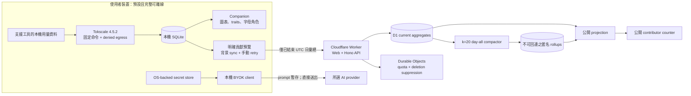

# TokenMonster

[English](README.en.md) · 繁體中文

TokenMonster 是一個 local-first 的 AI 使用量夥伴：它在本機整理 token
用量、呈現內容不可知的趨勢，並讓可解釋的字母角色依工作型態產生互動。使用者也可在
明確預覽與同意後，選擇把嚴格限縮的 UTC 每日彙總貢獻給公開計數器。

> **目前狀態：可測試的 source vertical slice，尚未上線。** Companion、Web、API、
> D1、Durable Objects、`k = 20` 匿名日彙整與安全的 scheduled maintenance
> 編排已在原始碼中實作；但還沒有 production／staging E2E 證據，也沒有配置
> Cloudflare account、D1 UUID、domain、routes 或 secrets。此 repository
> 不應被描述成 production service、公開 Alpha 或已簽署的發行版。

## 核心承諾

TokenMonster 的隱私邊界是產品需求，不是日後才補上的設定。

- 永遠不保存、記錄、分析或送到 TokenMonster cloud：prompt、response、原始碼內容、
  filename、project path、API key、OAuth token 或 provider credential；cloud 也不保存
  或記錄原始 HTTP request body。
- 本機收集、圖表、角色推導、固定台詞、匯出與重設，不需要 TokenMonster cloud；
  cloud 關閉或離線時仍應可用。
- 匿名貢獻預設關閉。只有使用者明確預覽並同意後，才會傳送嚴格 schema 的已結束
  UTC 日彙總；hourly 資料、event/session count 與今日未完整資料只留在本機。
- 公開數字只能稱為「選擇加入之貢獻者分享的 tokens」；它不是全世界的 AI 用量，
  也不是具統計代表性的樣本。
- 角色 traits 由可說明的工作流程特徵推導，不是強弱排行榜；產品不獎勵浪費 token，
  也不加入 pay-to-win 機制。
- BYOK key 留在本機 secret store。使用者主動發出的聊天內容只會暫存在 companion
  記憶體，並由本機直接送往所選 provider；它不會經過 TokenMonster API 或 D1。

詳細資料生命週期請閱讀 [Data inventory](docs/DATA_INVENTORY.md) 與
[Threat model](docs/THREAT_MODEL.md)。

## 現有功能與發行狀態

| 區域 | 目前 source slice | 上線前狀態 |
| --- | --- | --- |
| Local companion | Electron UI、本機 SQLite、7／28 日內容不可知趨勢、角色 traits／固定台詞、share card、export／reset | 已實作及本機測試；仍需各平台原生與 packaged smoke |
| Collector | exact-pinned `tokscale@4.5.2`、固定 argv、輸出限額、strict parser、Linux／macOS denied-egress sandbox | 已實作；Windows 收集維持停用，直到 no-egress sandbox 通過稽核 |
| Characters | 四個 TokenMonster-owned 字母 placeholder、可解釋 traits、繁中／英文固定台詞、BYOK persona context | placeholder 可用；AI-Sister raster 仍因 redistribution rights 與 brand review 被阻擋 |
| BYOK | Companion main process 直接呼叫 OpenAI Responses API；`store: false`、`background: false`，不使用 tools／files／conversation IDs | 已實作；仍需安全 release host 與真實 key 的人工 network smoke |
| 匿名貢獻 | 預設關閉、精確 payload preview、accountless enrollment、背景 sync／冪等 retry、stop、delete／status | 已實作及本機測試；尚未做 staging／cloud-off packet-capture E2E |
| Web／API | zh-TW-first React/Vite SPA、Hono Worker API、公開 totals、enrollment／ingest／delete／status | 已實作、build 及 fail-closed dry-run；未配置遠端環境 |
| Cloud data | D1 guarded mutation、deletion、projection、retention、Durable Object rate limit／suppression | 已實作及本機測試；仍需真實 D1 migration、容量及故障演練 |
| 匿名 compaction | 完整 UTC day 的 `day-all-v1`、`k = 20` gate、mapping-free rollup、commit-time race guards | 已實作及本機測試；尚未有 staging／production E2E |
| Scheduled maintenance | deletion → compaction → retention → projection；retention 保留 compaction-owned input，避免部分日期被先刪除 | 已實作及本機測試；尚未在真實 Cron Trigger／D1 驗證 |
| 安裝包 | 可產生並驗證 internal unsigned Linux／macOS ASAR／ZIP，含固定 Tokscale MIT notice | 不是公開 installer；signing、notarization、DMG／updater 與原生 smoke 仍為 STOP |

## 系統架構



Cloud path 只接收版本化合約中的 coarse daily aggregates。Companion 與 cloud
共用 strict contracts，但 cloud 從未取得本機 SQLite、provider key 或對話內容。

## Repository 結構

```text
apps/
  companion/        Electron 本機 UI、secure IPC、收集編排與 BYOK／貢獻流程
  web/              React/Vite 公開介面與 Cloudflare Worker entry
  api/              可攜式 HTTP composition 與 fail-closed Cloudflare composition
packages/
  contracts/        本機與 cloud 共用的 versioned strict schemas
  usage-domain/     內容不可知的使用量正規化與領域規則
  collector-core/   single-authority 排程、spool、retry 與 complete-scan evidence
  collector-tokscale/ exact-pinned Tokscale adapter 與 denied-egress runner
  local-store/      本機 SQLite、revision、outbox 與 reset/export 邊界
  monster-engine/   deterministic、explainable trait derivation
  characters/       角色 catalog、固定台詞、placeholder 與 asset release gate
  secret-vault/     Electron safeStorage 邊界
  byok-openai/      本機 direct OpenAI Responses adapter
  api-domain/       enrollment、ingest、delete/status 的 framework-free domain
  api-cloudflare/   Cloudflare auth、quota、suppression adapters
  cloud-d1/         D1 schema、guarded mutations、compaction、retention、projection
docs/               Product／technical specs、runbook、threat model、ADRs、checklist
scripts/            repository、secret、build 與 release artifact verifier
```

依賴方向是 `apps → adapters → domain/contracts`。領域 package 不得反向依賴
Electron、Hono、D1 或 UI framework。

## 前置需求

- Node.js `24.15.0`
- npm `11.12.1`
- Git
- Linux 真實 collector denied-egress integration test：`bubblewrap` 與 `strace`
- macOS collector：系統提供的 `sandbox-exec`；公開發行另需 Apple signing／
  notarization 身分與受控 release host
- Cloudflare 遠端操作：Wrangler 與 owner 核准的 account／environment；只跑本機
  build 或 dry-run 不需要 production credential

Windows collector 目前明確不支援。不得改成未隔離 spawn，也不得用
`--no-sandbox` 繞過 Electron 或 collector 的安全控制。

## 安裝與本機開發

```sh
git clone https://github.com/teddashh/TokenMonster.git tokenmonster
cd tokenmonster
npm ci
```

啟動 Web UI 的 Vite development server：

```sh
npm run dev --workspace @tokenmonster/web
```

在沒有 `TOKENMONSTER_DB` binding 時，公開 totals 會刻意回傳 sanitized `503`；
不會顯示 demo 或假總數。

Companion 的 renderer 開發 server：

```sh
npm run dev --workspace @tokenmonster/companion
```

建置並啟動完整 Electron companion：

```sh
npm run build --workspace @tokenmonster/companion
npm run start --workspace @tokenmonster/companion
```

若目前 Linux host 的 Chromium sandbox／AppArmor 不符合條件，啟動應 fail closed。
請換到正確隔離的測試 host，不要加 `--no-sandbox`。

## 驗證、測試與建置

提交前的完整本機 gate：

```sh
npm run format:check
npm run lint
npm run verify:secrets
npm run typecheck
npm test
npm run build
npm run verify:packaging-toolchain
npm run verify:artifacts
npm audit --audit-level=high
```

執行單一 workspace 時可使用 npm workspace flag，例如：

```sh
npm test --workspace @tokenmonster/cloud-d1
npm run typecheck --workspace @tokenmonster/collector-tokscale
npm run build --workspace @tokenmonster/web
```

### Worker dry-run

以下只做 build／bundle 驗證，不會建立或修改遠端資源：

```sh
cd apps/web
npx wrangler deploy --dry-run --outdir .wrangler/dry-run
cd ../..
```

Dry-run 成功不代表 staging 或 production 可部署。Checked-in Wrangler config
刻意沒有 D1 UUID、custom domain、routes、environment secrets 或 mutation enable
flag；缺少任何必要 binding 時，cloud write path 必須 fail closed。

### Internal companion package

```sh
npm run make:companion:internal
npm run verify:companion-package
```

此流程只產生並稽核 unsigned internal ASAR／ZIP；輸出與 evidence 不應提交。
它不是 signed／notarized installer，也不構成 Alpha release。

## 匿名貢獻流程

1. 使用者先在本機看到精確 payload preview；未同意時沒有 enrollment 或 upload。
2. 只有已結束 UTC 日、四個 collector scope 都有 complete-scan evidence，且整日
   coverage 完整的 daily buckets 才能進入候選 payload。今日、partial day、hourly、
   raw events 與對話內容都不符合資格。
3. Enrollment 與 upload 只允許 reviewed HTTPS origin，且 contribution credential
   slots 必須有 OS-backed safe storage；不安全的 Linux `basic_text` backend 無法 opt in。
4. 明確加入後，main-process 單次 timer 會在啟動、喚醒與本機完整掃描後排程背景
   sync；沒有 due payload 時不發出任何 request。Retry 重用原 body 與 `batchId`，
   避免重複加總；使用者仍可手動 retry，絕對值 revision 允許 missing key 送出更高
   revision 的 zero correction。
5. Stop 會移除 upload authority 與本機 outbox，但保留獨立 deletion authority；
   delete／status 使用彼此分離的 credential lifecycle。
6. Cloud 只在完整 expired day 做 `day-all-v1` compaction。符合至少 20 位 eligible
   contributors 才寫入 mapping-free coarse rollup；不足門檻的 expired attributable
   rows 會整日刪除，不發布小 cohort。

重要限制：scheduler 只有本機 fake-timer／service tests；staging packet capture、
retry／out-of-order E2E、真實 D1 compaction／retention race rehearsal 仍待完成。

Companion 的 cloud origin 由 `TOKENMONSTER_API_BASE_URL` 指定，必須是 compiled
allowlist 內的 exact HTTPS origin。不要把 production secrets 放進 `.env`、repository、
logs、screenshots 或 release evidence。

## BYOK 邊界

目前 source slice 的 optional BYOK path 由 Electron main process 直接呼叫 OpenAI
Responses API：

- API key 優先放入 OS-backed Electron `safeStorage`；不安全或不可用的 backend
  只允許 RAM-only session，不寫入磁碟。
- Prompt／response 只存在 bounded memory，切換角色、移除 key、關窗或 process
  結束時清除。
- Request 明確使用 `store: false`、`background: false`，並停用 files、tools、
  hosted search、conversation IDs 與 redirect。
- TokenMonster Worker、D1、analytics 與 public API 永遠不接收 provider key 或
  BYOK 對話內容。

使用 BYOK 仍代表內容會直接傳送給使用者選定的 provider，並受該 provider 的條款與
資料政策約束；TokenMonster 不應把這條 direct path 描述成「內容完全不離開裝置」。

## Cloud 設定與部署

遠端部署必須依 [Deployment runbook](docs/DEPLOYMENT_RUNBOOK.md) 逐項完成。關鍵
binding／設定包含 `TOKENMONSTER_DB`、獨立 Durable Object namespaces、
`TOKENMONSTER_MUTATIONS_ENABLED`、credential／rate-key secret config 與 exact allowed
public origin。實際名稱、UUID、routes 及 secret values 都是 environment-owned，不能
提交到此 repository。

Production／staging 目前都是 **STOP**，至少還缺：

- owner 核准的 Cloudflare account、D1 Paid、隔離的 dev／staging／production
  environments、D1 UUID、custom domain、routes、secrets 與 reviewed origins；
- 真實 Wrangler D1 migration、API／Cron／Durable Object／`k = 20` compaction 的
  staging E2E、load／SLO 與 failure-injection evidence；
- companion background contribution scheduler 的 staging packet capture、睡眠喚醒與
  長時間 retry soak 證據；
- signed／notarized installers、nested native binary／DMG／updater 驗證，以及支援
  平台的 native packaged smoke；
- 加密 logical backup、deletion suppression replay、restore-from-zero 與 rollback drill；
- privacy／terms／legal review、project license 決策與 third-party redistribution review；
- AI-Sister raster redistribution rights、來源證據與獨立 brand review。現階段只可使用
  code-native 字母 placeholder。

在所有 gate 有可重現證據以前，不要建立 production D1、開啟 mutation flag、發布
download link，或把本專案稱為已上線。

## Collector 與角色來源

預設 collector 固定為 `tokscale@4.5.2`。Adapter 不接受 caller-controlled
executable、argv 或 arbitrary environment，並將 upstream JSON 立即投影成最小化、
allowlisted 的 daily aggregate schema。`tokentracker-cli@0.79.8` bridge 只是規劃中的
mutually exclusive compatibility path，現在不是可用功能，也不能與 Tokscale 結果相加。

針對最小 parser／sandbox patch 維護的 fork：
[teddashh/tokenmonster-collector](https://github.com/teddashh/tokenmonster-collector)。

AI-Sister／`multi-ai-chat-app` 只作為設計參考與候選 persona 來源。Repository
目前不包含核准可發行的 AI-Sister raster；四個 provider-inspired characters 都以
TokenMonster-owned、independent-unaffiliated 的字母 placeholder 呈現。

## 文件索引

- [Product specification](docs/PRODUCT_SPEC.md)
- [Technical specification](docs/TECHNICAL_SPEC.md)
- [Implementation and launch plan](docs/IMPLEMENTATION_PLAN.md)
- [Deployment runbook](docs/DEPLOYMENT_RUNBOOK.md)
- [Private Alpha release checklist](docs/ALPHA_RELEASE_CHECKLIST.md)
- [Data inventory](docs/DATA_INVENTORY.md)
- [Threat model](docs/THREAT_MODEL.md)
- [ADR 0001：repository boundaries](docs/adr/0001-repository-boundaries.md)
- [ADR 0002：runtime and deployment](docs/adr/0002-runtime-and-deployment.md)
- [ADR 0003：D1 atomic mutation adapter](docs/adr/0003-d1-atomic-mutation-adapter.md)
- [ADR 0004：Electron packaging and signing](docs/adr/0004-electron-packaging-and-signing.md)
- [Third-party notices](THIRD_PARTY_NOTICES.md)

## 參與開發

這是 private、pre-release repository。任何資料 shape、collector command、角色 asset、
network destination、credential lifecycle 或 retention 行為的變更，都必須同步更新
contracts、privacy regression tests、data inventory、threat model 與 release checklist。
禁止把 prompt、response、path、filename、raw model label、key 或真實使用者 fixture
加入測試、log、analytics 或 issue attachment。

## License

Project license 尚未決定，repository 目前沒有提供對外使用或再散布授權。第三方
component 仍受各自 license 約束，詳見 [THIRD_PARTY_NOTICES.md](THIRD_PARTY_NOTICES.md)。
在 legal／rights review 與明確 license 檔案完成前，本專案只供內部開發與評估。
