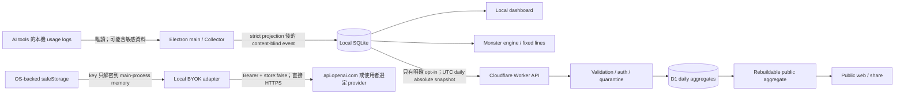

# TokenMonster 技術規格

> Architecture update (2026-07-15): collector, local store, IPC, and packaging
> sections that assume Tokscale/Electron are legacy migration notes. The
> permanent runtime boundary is specified by
> [ADR 0005](adr/0005-permanent-tokentracker-sidecar-adapter.md).

| 欄位         | 內容                                                                         |
| ------------ | ---------------------------------------------------------------------------- |
| 文件狀態     | Target architecture + tested source-slice baseline；不是 production evidence |
| 文件版本     | 0.1.0                                                                        |
| 更新日期     | 2026-07-16                                                                   |
| 對應產品規格 | `docs/PRODUCT_SPEC.md`                                                       |
| 對應架構決策 | `docs/adr/0001-repository-boundaries.md`                                     |
| 首要目標     | 以 local-first、content-blind、可刪除、可回復的方式把 TokenMonster 安全上線  |

## 1. 規範語意與決策摘要

本文使用「必須」、「不得」、「應該」、「可以」表示 RFC 2119 等級的要求。除非另有 ADR 取代，本文是 MVP 實作與上線驗收的技術基線。

截至 2026-07-17，local Companion、exact-pinned TokenTracker sidecar、11 位角色／進度、
asset integrity cache／letter fallback、BYOK/固定互動、monster、Web/API、
匿名 contribution preview/enrollment/background-sync/delete source slice、D1 mutation/
deletion、`day-all-v1` k=20 compaction、preserving retention、projection與Durable
Object source slice已有本機測試。Scheduled Worker 已按
`deletion → compactor → preserving retention → projection` 執行，compactor每次最多
處理一個完整結束且已到期的UTC日。Cloudflare account／remote D1／domain／secrets、
remote rehearsal／staging E2E、Companion background packet capture／wake soak、
signed installer、native smoke、backup/restore與suppression replay、license／法律決策及
production operations仍未形成上線證據。本文未標成「pending」的 target requirement
也不代表已部署；current truth以README、Implementation Plan快照與Release Checklist為準。

已裁決的核心決策如下：

1. TokenMonster 是獨立 monorepo；不 wholesale fork TokenTracker、token-monitor、ai-avatar-bot 或 AI-Sister。
2. collector 預設且唯一的直接來源是精確鎖版 `tokentracker-cli@0.80.0` child。
3. TokenMonster 只透過 fixed loopback aggregate routes 與 strict adapter 取用 TokenTracker；Tokscale／Electron 是 migration-only legacy slice，不得成為第二使用量 authority。
4. 本地只保存投影後的 daily/hourly aggregates；雲端只接收 UTC daily absolute snapshots，不接收原始事件、session/event count 或內容。
5. 匿名貢獻預設關閉。沒有同意時，核心 dashboard、角色引擎與固定台詞仍完整在本機運作。
6. 新建 hosting 的預設是單一 Cloudflare Worker：同一 deploy unit 提供 React/Vite static assets 與 Hono API，D1 作為雲端資料庫。`apps/web` 與 `apps/api` 仍保留邏輯邊界，也可日後分拆。
7. 支援的 companion 是 CLI 組合的 loopback gateway 與輕量靜態 UI；Electron 是 migration-only legacy slice。
8. Release 內嵌 combined strict schema-v2 rights authority、descriptor 與 exact HTTPS allowlist，涵蓋 11 位角色的 891 張圖片與 55 條 canonical WAV，共 946 entries。候選 npm package 在 release staging 另加入該 authority 的精確 8 個 WebP／415,470 bytes：ChatGPT、Claude、Gemini、Grok 各一張 avatar 與 `tech` 基本服裝，搭配 168 條 `zh-TW`／`en` 內建文字且不含 audio。未同意、離線缺完整 cache、失敗或撤銷時，四位基本圖文仍為 zero runtime GET，其他缺圖狀態才 letter/silent fallback，語音保持靜音；明確啟用才單次取得一個 usage-independent combined fixed pack。Schema-v1 manifest 只保留為歷史 audit input，其名稱不代表 public approval。這些是候選 artifact 規則，不代表 application release 已發布。

## 2. 上線目標、非目標與硬性守門

### 2.1 MVP 上線目標

- 可下載、簽署且可自動更新的 companion。
- 本機匯入、去重、修正與圖表，中央服務離線時仍可使用。
- 可解釋且 deterministic 的 AI 字母人 traits、mood、2D 狀態與固定台詞。
- 明確 opt-in 的匿名 daily aggregate 貢獻、payload preview、pause、resume、刪除與可撤銷分享。
- 誠實標示「TokenMonster 貢獻者已分享的 Token 總量」的公開網站。
- 至少一條 local BYOK 正式路徑；中央 TokenMonster API 永遠不接觸 provider key 或對話內容。

### 2.2 非目標

- 不作 provider 帳單或全球 AI 用量的權威來源。
- 不 scrape 消費者網站、不攔截 prompt/response、不讀原始碼或檔案內容。
- 不做排行、戰力、付費抽卡或以燒 Token 換無限獎勵。
- MVP 不做 Live2D、3D、即時或使用者提交的 voice cloning service、STT 或長期雲端聊天記憶；預錄、已核准且只從本機驗證 cache 播放的固定語音不在此列。
- 不將上游 local API、telemetry、cloud sync 或社群功能原樣帶進產品。

### 2.3 Public beta 前的硬性 release gates

下列任何一項失敗，都不得 public beta：

- collector 互斥鎖、absolute report 重掃、retry、out-of-order 與 downward correction 測試全數通過。
- recursive privacy test 證明 cloud payload、log、diagnostic report 不含禁止欄位。
- Exact-pinned TokenTracker managed child、adapter schema與loopback gateway的compatibility/privacy/lifecycle tests通過；legacy tokscale contribution slice保持停用且不得與sidecar totals相加。
- pause、hot-data delete 與 backup restore 後 deletion replay 完成實測。
- Electron 完成 code signing/notarization、CSP、IPC、navigation 與 secure storage review。
- 所有公開角色 asset 的 `releaseStatus=approved`；否則只能使用另行創作且權利清楚的 TokenMonster 原創 placeholder。
- OSS notices、上游精確版本、SBOM 與鎖檔可重現。
- staging load test 達成本文 SLO，並建立 D1 容量與 int64 80% 告警。

## 3. 系統架構與 monorepo 邊界

### 3.1 選定技術棧

| 層            | MVP 選擇                                                          | 約束                                                                                 |
| ------------- | ----------------------------------------------------------------- | ------------------------------------------------------------------------------------ |
| Monorepo      | npm workspaces、root `package-lock.json`、`npm ci`                | production dependency 一律 exact pin，不使用 `^`/`~`；lockfile 是 release artifact   |
| 語言          | strict TypeScript、Node.js 24 LTS toolchain                       | domain package 不依賴 Electron 或 Cloudflare globals                                 |
| Web           | React + Vite                                                      | build 產物由 Worker Static Assets 提供                                               |
| API           | Hono on Cloudflare Workers                                        | Web-standard Request/Response；禁止直接把 D1 type 滲入 domain contract               |
| Companion     | Electron main/preload + React/Vite renderer                       | macOS first；collector、SQLite、BYOK network 只在 main process                       |
| Local storage | Node 24 built-in `node:sqlite`，只在 main process                 | WAL、foreign keys、busy timeout、0600/使用者專屬 ACL；不把 DB handle 暴露給 renderer |
| Cloud storage | Cloudflare D1 Paid                                                | daily aggregates only；prepared statements；small batches                            |
| Schema        | TypeScript types + Zod runtime validation + generated JSON Schema | wire contract 在 `packages/contracts` 單一來源                                       |
| Tests         | Vitest、Playwright、Miniflare/Workers integration、Electron E2E   | golden fixtures 必須跨 OS                                                            |
| CI/CD         | GitHub Actions 或等價 CI、Wrangler、簽署 Electron updater         | dev/staging/prod 完全分離                                                            |

新增 runtime dependency 時，實作者必須在同一 PR 鎖定精確版本、提交 lockfile、記錄 license，並說明為何需要；本文不以「latest」代表可重現版本。

### 3.2 Workspace 邊界

```text
apps/
  web/                 React UI；不得直接碰 D1、upload token 或 provider key
  api/                 Hono Worker entry、routing、Cloudflare bindings
  companion/           Electron main/preload/renderer、internal package；signed installer/updater pending
packages/
  contracts/           wire/local schemas、error codes、forbidden-field guard
  token-tracker-runtime/ exact pin resolution、managed child lifecycle、local refresh
  token-tracker-adapter/ strict fixed-route schema validation與content-blind DTO projection
  companion-gateway/  loopback session、fixed browser API/static routes
  companion-ui/       strict DTO-only static local UI
  cli/                唯一支援的one-command runtime composition
  contribution-runtime/ opt-in preview/outbox/lifecycle與strict sidecar daily projection
  collector-core/與collector-tokscale/（migration-only contribution slice）
  monster-engine/      pure deterministic rules、explanations、versioning
  characters/          rights-gated manifests、2D layers、fixed-line schemas
  usage-domain/        idempotent absolute-snapshot、authority、retention/compaction rules
  cloud-d1/            D1 schema、mutation/deletion、day-all-v1 compaction、projection與hard-retention adapters
  api-domain/          enrollment/ingest/delete/status use cases與storage/rate-limit ports
  api-cloudflare/      credential、policy、rate-key與Workers crypto adapters
  byok-openai/         companion-only Responses adapter；store:false、bounded direct request
  local-store/         content-blind SQLite、scan ledger、insights/export/reset
  secret-vault/        Electron safeStorage policy與memory-only fallback
```

依賴方向必須是：`apps -> adapters -> domain/contracts`。`contracts`、`monster-engine` 與 `collector-core` 不得反向 import app、Electron、Hono、D1 或 Node-specific UI code。

### 3.3 Repository 與 fork 策略

- Production exact-pins `tokentracker-cli@0.80.0` as an npm dependency and resolves that installed public bin; runtime never floats to `latest` or downloads an unreviewed version.
- TokenTracker is the sole collection engine. TokenMonster does not attach to an arbitrary existing server, discover/kill by PID or port, or add a second scanner.
- TokenMonster never forks, vendors, submodules, deep-imports, or copies TokenTracker parser/hook code and never reads its queue files or provider databases. Legacy tokscale workspaces are migration-only and receive no new product features.
- `token-monitor` 與 `ai-avatar-bot` 僅供架構參考，不搬入 runtime source。
- AI-Sister source 與 raw parts 不 vendoring 或 submodule 進 TokenMonster。TokenMonster release 只內嵌通過 schema-v2 gate 的 immutable output manifest、固定 pack descriptor、exact allowlist 與必要 persona facts；目前 combined image + voice fixed pack 由 AI-Sister 管理的 `https://cdn.ted-h.com` 提供，只有使用者明確啟用才發出一個固定 GET。

## 4. Trust boundaries 與資料流



### 4.1 Trust zones

1. **Untrusted local source zone**：usage logs、CLI JSON、TokenTracker loopback response 都視為不可信輸入，可能巨大、畸形或含 prompt/path/MCP server 設定。
2. **Privileged companion zone**：Electron main 可讀檔、spawn process、開 SQLite 與解密 key；renderer 不具有這些權限。
3. **Local content-blind zone**：strict projection 後的 usage 與 monster state。即使只在本機，也不得持久化 prompt、response、source code 或完整 path。
4. **Contributor cloud zone**：只有 pseudonymous daily aggregate。upload/deletion secrets 是 bearer credentials，與 web session 分離。
5. **Public zone**：公開 total、達 k-threshold 的 breakdown、使用者明確選取的 share descriptor。
6. **BYOK provider zone**：對話內容會直接送到使用者所選 provider，受該 provider 的 data policy 約束；TokenMonster 中央服務不在路徑上。

### 4.2 永遠禁止離開本機的資料

contract guard 必須遞迴拒絕、logger 必須 allowlist，而不是只 redaction：

- prompt、response、message、conversation text、source code、clipboard；
- filename、完整/相對 project path、workspace/project/repository 名稱、hostname；
- raw session/event ID、session/event count、account/e-mail/team/org ID；
- API key、OAuth token、cookie、provider credential、TokenTracker device token；
- 未投影的上游 JSON、MCP server name/config、environment variables；
- raw IP 的長期儲存或 analytics identifier。

公開 cloud model 只保留 allowlisted `modelFamily`，custom/raw model ID 一律映射成 `other`；本地 UI 可以顯示經過濾的較細 model label，但不得因此進入 wire payload。

## 5. Collector 架構

Sections 5.1–5.4 preserve the already-implemented legacy contribution contract
because `IngestSnapshotV1` still enumerates its historical authority IDs. They
are migration-only, are not the supported companion collector, and must not
receive new product features. The permanent runtime is section 5.5 and ADR 0005. A sidecar-to-contribution mapper requires a new reviewed contract/cutover;
the legacy enum must never be used to mislabel sidecar data.

### 5.1 Legacy contribution authority (migration-only)

本機 `collector_authority` 只有一筆 active row，且另以 OS-level single-instance lock 防止兩個 companion 同時收集。狀態機如下：

```text
STOPPED -> STARTING -> RUNNING -> STOPPING -> STOPPED
                   \-> DEGRADED
STOPPED -> SWITCH_PREVIEW -> RUNNING
```

不變量：

- 在此legacy slice內，`RUNNING` authority 必須恰好一個，kind只能是`tokscale`或`tokentracker-bridge`；兩者都不是目前支援的companion runtime。
- 任何 dashboard/cloud bucket 只來自 active authority；不得相加兩個 collector 的結果，也不得以「去掉看起來重複的部分」來猜。
- V1 的 authority 是本機選擇與每個 snapshot 的 `collector.kind`，不是 wire generation。每個 daily key 各有自己的單調 `revision`；server ordering 不使用 wall clock。
- 本機切換必須先 stop 舊 collector、取得 lock、清除由舊 authority 產生的 local aggregates、掃描新來源並顯示差異 preview。V1 若 contribution 已啟用，不支援保留歷史的 in-place cloud switch；UI 必須先 pause 並走「stop and delete／重新 enrollment」，或維持原 authority。跨 authority server-side full-set replacement 列為 V2 候選。

### 5.2 Legacy `tokscale@4.5.2` adapter (migration-only)

必須 bundle 精確版本並在啟動時驗證 package version/integrity。spawn 規則：

- `shell:false`，binary path 必須解析到 app bundle 內，argv 來自常數 allowlist；禁止接受 renderer 或使用者任意 argv。
- 使用最小化 env allowlist，強制 `TOKSCALE_CONFIG_DIR=<TokenMonster private dir>`、`TOKSCALE_PRICING_CACHE_ONLY=1`。
- 明確移除 `TOKSCALE_API_TOKEN`、`TOKSCALE_API_URL`、`TOKSCALE_EXTRA_DIRS`、`TOKSCALE_HEADLESS_DIR` 與任何 upstream login/autosubmit 相關變數。
- 絕不呼叫 login、submit、autosubmit、usage/cursor integration 或任何 network/account command；只允許經 fixture 審核的 fixed local aggregate report command。
- subprocess 設定 timeout、stdout/stderr size cap、bounded termination/kill escalation 與 sanitized error code；stderr 不進 production log。
- **絕不呼叫 `tokscale graph`**。該輸出可含 `mcpServers` 等不需要資料；「先呼叫再丟欄位」也不被允許。
- Daily provider/model/tool mix 只來自 allowlisted fixed report template：一次只掃一個已核准 client 與一天，以 `tokscale --json --client <client> --group-by client,provider,model --since <day> --until <day> --hide-zero --no-spinner` 產生 absolute aggregate。adapter 只投影 day、provider/model/tool mapping 與 token ledger；cost、duration、performance、warnings 與其他欄位全部丟棄。UTC day 邊界必須有 platform fixture；無法證明時不得上傳該 source。
- adapter registry 必須聲明來源 ownership/overlap。會鏡像或匯入另一來源資料的工具（例如把其他 CLI session 再匯入自己的資料庫）預設 disabled，直到 fixture 能證明 stable cross-source dedupe；不得以相近時間/數值 heuristic 猜重複。

已知 v4.5.2 的 Codex normalization 風險必須由 TokenMonster adapter 防守：cached input 已從 non-cache input 拆出，但上游 `TokenBreakdown.total()` 仍可能再次加上已包含於 output 的 reasoning。TokenMonster 不採信該 total；必須按第 6 節公式自行計算，並以 Codex golden fixture 鎖住行為。這是若需建立 dedicated fork 時的第一個 upstream-patch 候選。

### 5.3 Legacy `tokentracker-cli@0.79.8` bridge target (never shipped)

bridge 只供使用者明確選擇，且必須：

- 驗證 exact version `0.79.8`；不接受未知 minor/major 的「可能相容」。
- 使用固定、隨機可用且只綁 `127.0.0.1` 的 port；Host 必須是 loopback，禁止 `0.0.0.0`、LAN 或外部 URL。
- spawn 時同時設定 `TOKENTRACKER_NO_TELEMETRY=1` 與 `DO_NOT_TRACK=1`。
- 透過 telemetry preference endpoint 驗證 disabled，並驗證 cloud-sync preference 是 false；無法讀取、狀態不一致或 upstream 重新開啟時立即 fail closed。
- 絕不啟用 TokenTracker cloud sync、不呼叫其 auth/community/pet/achievement API、不讀或傳 device token。
- preference allowlist 只有 `/functions/tokentracker-telemetry-pref` 與 `/functions/tokentracker-cloud-sync-pref`。usage allowlist 只可包含經 fixture 驗證的 `/functions/tokentracker-usage-summary`、`/functions/tokentracker-usage-daily`、`/functions/tokentracker-usage-hourly`、`/functions/tokentracker-usage-model-breakdown`；不得把其他 endpoint 自動視為安全。
- 只讀上述已審核的 aggregate endpoints；response 經 size/time limit 與 strict schema projection。
- 不得靜默 attach 到一個由其他 process 管理、telemetry 狀態未知的 server。UI 必須說明將啟動/連接的 process 與退出方式。

bridge 的輸出經同一 canonical normalizer，cloud protocol 看不到 upstream 差異。

### 5.4 Legacy fixed-report correction model

MVP 不要求 tokscale 提供 stable event fingerprint、session watermark 或 raw-event dedupe。安全 adapter 每次重新執行 bounded fixed aggregate report，以完整 absolute row 覆蓋相同 key：

- Daily key 是 UTC day + provider + model family + tool；只有投影值改變時才把該 key 的 positive safe-integer `revision` + 1。來源後續修正可以下降或歸零。
- 本地 rhythm 若實作，另以 `tokscale hourly --json --client <one-approved-client> --since <local-day> --until <local-day> --no-spinner` 逐 client/day 掃描。它不是 daily adapter 的副產品。
- Hourly JSON 的 `clients`/`models` arrays、`messageCount`、`turnCount`、`cost`、`totalCost`、processing/performance 與 warnings 全部丟棄；只投影 hour label 與 token ledger。hourly rows 永遠不進 contribution mapper。
- v4.5.2 hourly label 是 local-time `YYYY-MM-DD HH:00`，沒有足夠資訊區分 DST fall-back 的兩個同名小時。adapter 必須記錄 `localTimeQuality="assigned"`、在 UI/trait explanation 揭露可能合併，並以固定 timezone rule 做 deterministic assignment；不得宣稱精確 UTC hour。
- 若 hourly adapter 尚未完成上述 fixture、DST 與 forbidden-field tests，產品把 hourly rhythm 標為 planned，MVP 仍可用 daily aggregates；不得假裝 daily report 已提供 event/hourly truth。
- 任何 report 的 raw stdout/stderr 都只在 process memory 完成 parse/projection後立即丟棄，不落盤、不進 IPC/log/diagnostic。

### 5.5 Permanent exact-pinned TokenTracker sidecar

- `packages/cli` is the supported `tokenmonster`/`npx tokenmonster` entry point. It composes and shuts down the exact-pinned runtime, strict adapter, loopback gateway, static UI, and optional browser launch.
- `packages/token-tracker-runtime` resolves only the tested `tokentracker-cli@0.80.0` public bin, owns child-object lifecycle, and terminates only children it created. No PID/port discovery or arbitrary executable/argv is allowed.
- `packages/token-tracker-adapter` calls only exact-tested loopback routes, validates strict responses, and projects content-blind TokenMonster DTOs. Raw upstream JSON, model/source extras, paths, credentials, and error text do not cross the boundary.
- TokenTracker remains the sole local usage authority. TokenMonster does not read its databases/queues, deep-import its implementation, or run a second parser/scanner.
- Current trustworthy time-series input is UTC daily aggregate data. The 0.80.0 hourly route combines sources, omits provider/source identity, and rounds to whole hours; it cannot support exact 2 h/5 h provider rolling windows and stays unused for that feature until an upstream exact-source sub-hour contract exists.
- Companion copy uses one typed `zh-TW`/`en` catalog. The selected locale is
  passed to fixed character interaction and drives all number/date formatting,
  static text, dynamic state/error copy, ARIA labels, and locally rendered
  share cards. Server-provided zh-TW tagline/explanation/theme labels are never
  rendered as English; the UI derives English copy from structured IDs.
- The fixed loopback `/api/preferences/locale` GET/POST stores only canonical
  `{schemaVersion, revision, locale}` bytes beside `progressionStorePath`.
  Session, Host, exact-Origin mutation, method, body/key, and query guards apply.
  Mutation is serialized under the one user-scoped runtime lease and uses
  goal-idempotent CAS plus a private atomic rename. POSIX opens use no-follow;
  all platforms compare lstat and opened-handle identity before reading and
  after rename. Corrupt or non-private state is preserved and returns a generic
  unavailable response; no path crosses the browser boundary and no preference
  reaches TokenMonster cloud. If persistence is unavailable, the exact
  session-gated `/session/locale/zh-TW` and `/session/locale/en` document routes
  carry only the tab's content-free override and force every localized/Intl
  projection to render again. Only the exact optional `?view=pet` query survives.

## 6. Canonical usage schema 與 normalization

### 6.1 Numeric type

Wire 的所有 Token 數字都是 canonical non-negative decimal string：`0|[1-9][0-9]*`，不得有小數、正號、前置零、指數或空白。

V1 單一 bucket 的每個 token 欄位與 `revision` 都必須 `<= Number.MAX_SAFE_INTEGER`。Worker 先以 `BigInt` parse、驗證上限與公式，再安全轉成 Number bind 到 D1 `INTEGER`。不得接受任意 30 位數字後直接塞入 D1。

公開總和由 SQLite/D1 的 int64 `SUM` 計算後 `CAST(... AS TEXT)` 回傳，不經 JavaScript Number。當任一 aggregate 達 signed int64 上限的 80%，必須停止擴大寫入、告警並完成 decimal-counter migration；不得等 overflow 才處理。

### 6.2 Disjoint token ledger

所有 adapter 必須正規化成下列互斥主 ledger：

```text
total = input + output + cacheRead + cacheWrite + other
reasoning <= output
```

- `input`：不含 cached input 的輸入 token。
- `output`：完整輸出 token，包含 reasoning output（若 provider 將其列為 output subset）。
- `cacheRead`：從 cache 讀取、原本屬於 input subset 的 token。
- `cacheWrite`：provider 明確報告且能安全拆出的 cache creation/write token。
- `other`：已知 total 中無法分類、或來源專屬但不屬於前四類的 token。
- `reasoning`：**只作 informational subset of output**，不得再加進 total。

OpenAI/Codex 的 `cached_input` 是 input subset；adapter 應以可靠來源欄位將其從 non-cache `input` 拆出。`reasoning_output` 是 output subset；不得從 `output` 扣除，也不得再加一次。不同來源若無法可靠拆解，必須把未分類數值放入 `other`，不得猜測比例。本地 UI 可另存 `localCoverage` 顯示「不可得」；`localCoverage` 明確是本地-only metadata，不是 V1 wire 欄位。

### 6.3 `DailyAggregateBucketV1`

`packages/contracts/src/ingest-v1.ts` 是 V1 唯一可執行真相；本文的型別只作閱讀鏡像，不得另建第二份 schema。

```ts
type DecimalTokenCount = string; // canonical decimal, 0..9007199254740991

interface DailyAggregateBucketV1 {
  bucketStart: string; // exactly YYYY-MM-DDT00:00:00.000Z, years 2020..2099
  provider: "anthropic" | "google" | "openai" | "openrouter" | "xai" | "other";
  modelFamily: string; // normalized lowercase slug, 1..64 chars
  tool: string; // normalized lowercase slug, 1..64 chars
  valueQuality: "exact" | "estimated";
  revision: number; // positive integer <= Number.MAX_SAFE_INTEGER; monotonic per server key
  tokens: {
    input: DecimalTokenCount;
    output: DecimalTokenCount;
    cacheRead: DecimalTokenCount;
    cacheWrite: DecimalTokenCount;
    reasoning: DecimalTokenCount;
    other: DecimalTokenCount;
    total: DecimalTokenCount;
  };
}
```

Cloud validator 必須使用 export 的 `IngestSnapshotV1Schema`，其 strict objects 會拒絕 unknown keys。額外 application checks：

- `modelFamily` 與 `tool` 必須符合 `[a-z0-9](?:[a-z0-9._-]{0,62}[a-z0-9])?`，且來自 versioned mapping/registry；未知值映射 `other`，不傳 raw string。
- `reasoning <= output`，且五個互斥主欄位以 BigInt 相加恰好等於 `total`。
- 同一 snapshot 不得出現重複 `(bucketStart, provider, modelFamily, tool)`。
- contract 接受 2020–2099 的合法 UTC midnight；service 再把超過合理 clock-skew 的 future bucket quarantine。
- cloud schema 沒有 timezone/hour、localCoverage、event/session count、raw event ID、bucket ID、client hash 或 arbitrary metadata map。

### 6.4 Normalization pipeline

```text
untrusted upstream JSON/files
  -> size/type validation
  -> strict field projection
  -> source-specific subset semantics
  -> controlled dimension mapping
  -> disjoint token ledger + invariant checks
  -> local absolute daily buckets
  -> optional local-only hourly projection
  -> strict IngestSnapshotV1 sanitizer
```

每個 adapter fixture 必須聲明：來源欄位定義、是否 inclusive、cache/reasoning subset 關係、time precision、model/provider/tool mapping、`valueQuality` 與本地不可得欄位。沒有 fixture 的來源只能標 `experimental`，不得預設上傳。

## 7. `IngestSnapshotV1` 與 absolute upsert protocol

### 7.1 唯一 V1 wire contract

Cloud payload 只含一至 30 個 UTC daily absolute buckets。`packages/contracts/src/ingest-v1.ts` 是唯一 V1 schema；所有 object 都是 strict，unknown property 直接拒絕。

```ts
interface IngestSnapshotV1 {
  schemaVersion: "1";
  batchId: string; // valid UUID；同一 whole-batch retry 不變
  generatedAt: string; // canonical UTC timestamp, 2020..2099
  collector: {
    kind: "tokscale" | "tokentracker-bridge";
    adapterVersion: string; // exact SemVer
    sourceVersion: string; // exact SemVer for the legacy migration contract
  };
  buckets: DailyAggregateBucketV1[]; // 1..30
}
```

V1 沒有 global revision、authority generation、mode、client deletion list、localCoverage 或 client-computed hash。Server 由 Bearer authentication 與 bucket 欄位建立 key：

```text
(authenticated enrollment, bucketStart, provider, modelFamily, tool)
```

wire 不傳 enrollment/contributor ID、bucket ID 或 payload hash；server 以 RFC 8785 canonical JSON + SHA-256 計算 whole-payload hash，並另對 canonical bucket 計算 row hash。Uncompressed body 最大 64 KiB、`Content-Type: application/json`；Cloudflare 平台更大的 body limit 不是產品 contract。

符合目前 schema 的範例：

```json
{
  "schemaVersion": "1",
  "batchId": "6b0b8cb1-cd48-47ef-b676-c5a71d02a74b",
  "generatedAt": "2026-07-15T18:22:04.000Z",
  "collector": {
    "kind": "tokscale",
    "adapterVersion": "0.1.0",
    "sourceVersion": "4.5.2"
  },
  "buckets": [
    {
      "bucketStart": "2026-07-15T00:00:00.000Z",
      "provider": "openai",
      "modelFamily": "gpt-5",
      "tool": "codex-cli",
      "valueQuality": "exact",
      "revision": 1842,
      "tokens": {
        "input": "1200",
        "output": "500",
        "cacheRead": "800",
        "cacheWrite": "0",
        "reasoning": "120",
        "other": "0",
        "total": "2500"
      }
    }
  ]
}
```

### 7.2 Server dedupe、out-of-order 與 correction

Server 必須依下列順序處理：

1. 驗證 TLS、Bearer credential、current consent、enrollment status、64 KiB、`IngestSnapshotV1Schema`、registry 與 BigInt token invariants。整批先驗證，不能先寫部分 invalid rows。
2. 計算 server payload hash。`(enrollment, batchId)` 首次出現時建立 receipt；相同 batchId + 相同 hash 回原 receipt，相同 batchId + 不同 hash 回 `409 BATCH_ID_REUSE`。receipt 保存 7 天。
3. 同一 snapshot 只有一個 `collector.kind`。Server 對 `(enrollment, bucketStart)` 維持 30 天 authority binding；同一 UTC source window 不得把 tokscale 與 TokenTracker bridge 相加。衝突回 `409 AUTHORITY_CONFLICT`。
4. 對每個 server key 比較 bucket 自己的 positive integer `revision` 與 server row hash：
   - incoming revision 較大：以完整 absolute row 取代，即使 total 下降或變成 0；
   - revision 相等、row hash 相同：idempotent no-op；
   - revision 相等、row hash 不同：整批回 `409 REVISION_CONFLICT`，不寫任何 row並記 security/quarantine event；
   - revision 較小：該 key 是 stale no-op，同批其他 higher-revision keys 可套用。
5. `generatedAt` 只用於 bounded queue/clock-skew 診斷，絕不作 ordering。
6. receipt 回 `appliedBuckets`、`staleBuckets`、`idempotentBuckets`、`quarantinedBuckets` 與 server `receivedAt`，不回顯 payload。

D1 adapter 使用 parameterized prepared statements 與 conditional upsert；batch receipt、最多 30 個 row changes 與 dirty-aggregate marker 應在 D1 transactional batch 完成。相同 revision 的 conflict preflight 與 write 必須防 concurrent race；D1 write single-threaded 不能取代 application invariant。

協議刻意不使用 `MAX()`/`GREATEST()` 合併 Token。公開 total 必須允許因來源修正、parser 修復、opt-out 或清零而下降，UI 不得強迫 counter 只增不減。

### 7.3 Per-key revision、清零與 client queue

- `cloud_mirror` 以 `(bucketStart, provider, modelFamily, tool)` 保存 last accepted absolute row 與 positive integer revision；revision 是 **per key**，不是 snapshot/global sequence。
- 首次出現的 key 從 revision 1 開始。投影值或 `valueQuality` 改變時 revision + 1；未改變就不送。
- 某個已接受 key 從新的 absolute report 消失時，client 送同 key、higher revision、七個 token 欄位全為 `"0"` 的 normal bucket。V1 沒有 delete/tombstone wire object；zero snapshot 阻止較舊 out-of-order value 復活，並使 public current total 扣除舊值。
- 若 client 已遺失完整 `cloud_mirror`，V1 不宣稱可安全做全歷史 replacement。UI 必須 pause contribution，要求 stop-and-delete/re-enroll，或等 V2 protocol；不得猜 delta。
- 成功 local DB commit 後才建立 body；`batchId` 與 `generatedAt` 隨序列化 body 固定，retry 不重建任一欄位。
- retry 使用 exponential backoff + full jitter（1 秒起、15 分鐘上限），遵守 `Retry-After`；只 retry network error、408、429、5xx。其他 4xx 顯示 sanitized action，不無限重送。
- `upload_spool` 最長保留 30 天且只含已通過 V1 parser 的 body。關閉 contribution 的預設動作是立即停止並清空 queue；只有使用者在 UI 明確選「先送完已排程資料」才可繼續既有 queue。
- spool 在 app-private SQLite，不得進 renderer localStorage、diagnostic 或 app backup export。

### 7.4 V2/post-MVP protocol boundary

跨 collector in-place switch、server-side staged reconciliation、authority generation、range tombstones與 atomic full-set replacement 都是 V2 候選，不屬於 `IngestSnapshotV1`，也不得先做未記錄的 private extension。V2 必須有新 contract/ADR、retention impact review、client/server compatibility plan 與新的 consent review後才能上線。

## 8. Storage model

### 8.1 Local SQLite

Local DB 由 Electron main process 單一 repository owner 開啟。必須啟用 `PRAGMA foreign_keys=ON`、WAL、busy timeout；migration 在 transaction 中進行，升級前建立同目錄權限受限的短期 backup。Token 欄位使用 INTEGER 並維持 safe-int invariant。

| Table                 | 主要欄位／key                                                                                                                      | 用途與限制                                                                                                  |
| --------------------- | ---------------------------------------------------------------------------------------------------------------------------------- | ----------------------------------------------------------------------------------------------------------- |
| `app_meta`            | `key PK`, `value`, `updated_at`                                                                                                    | schema version、installation-local IDs；不得放 secret                                                       |
| `collector_authority` | singleton PK、kind、state、adapter_version、source_version、updated_at                                                             | single authority source of truth；沒有 cloud generation                                                     |
| `collector_runs`      | run_id PK、adapter、started/ended、status_code、projected_row_count                                                                | sanitized diagnostics；不得存 stderr/path/raw JSON                                                          |
| `adapter_state`       | adapter + source PK、strict cursor/provenance fields                                                                               | 只有明確支援 safe cursor 的 adapter 可用；tokscale fixed reports 不要求/不寫 event watermark                |
| `usage_hourly`        | local hour label + tool PK、token ledger、timezone、`local_time_quality`、source/adapter version                                   | optional local-only rhythm；無 message/turn/count/cost/model arrays，永不進 cloud                           |
| `usage_daily`         | bucket_start + provider + model_family + tool PK、token ledger、value_quality、per-key revision、localCoverage、collector metadata | absolute daily truth；`localCoverage` 只供 UI，wire mapper type 看不到它                                    |
| `cloud_mirror`        | bucket_start + provider + model_family + tool PK、last accepted V1 row/revision/receipt                                            | 產生 absolute correction 與 higher-revision zero row；遺失完整性即停止 contribution                         |
| `upload_spool`        | batch_id PK、generated_at、payload_json、attempts、next_attempt、state、expires_at                                                 | 僅保存 parse-valid V1 body，最多 30 天，停用時依明確選項清除                                                |
| `consent_state`       | purpose PK、document_revision、granted、changed_at                                                                                 | contribution、product analytics、BYOK/TTS 分開 consent                                                      |
| `cloud_enrollment`    | status、upload/delete secret refs、last_receipt_at                                                                                 | 不存/傳 stable enrollment ID；active 與 complete pending bundle 都只在 OS-secret-store adapter，不在 SQLite |
| `monster_state`       | character_id PK、engine_version、traits_json、mood_json、as_of_revision                                                            | 可從 usage 重算                                                                                             |
| `monster_events`      | event_id PK、rule_version、reason_code、window、before/after/input_summary、expires_at                                             | 可解釋變化；本地 mood history 預設 30 天                                                                    |
| `fixed_line_ledger`   | line_id + character_id PK、last_shown、show_count                                                                                  | cooldown 與避免重複                                                                                         |
| `reminder_ledger`     | rule_id + scheduled_at PK、fired_at、dedupe_state、expires_at                                                                      | 本地-only，預設 30 天                                                                                       |
| `inventory`           | item_id PK、earned_reason、earned_at、equipped                                                                                     | cosmetic only                                                                                               |
| `draw_ledger`         | draw_id PK、rule_version、seed_commitment、result_id、created_at                                                                   | 後續免費 deterministic cosmetic；不得與付費/戰力相連                                                        |
| `share_drafts`        | draft_id PK、descriptor_json、created_at                                                                                           | 使用者選取欄位；無 prompt/account/path                                                                      |
| `settings`            | key PK、typed_value                                                                                                                | 非 secret 設定；API key 禁止放此表                                                                          |

MVP 不建立 raw/local `usage_events` table，也不持久化 message/turn/event/session count。`toIngestSnapshotV1()` 只接受與 `DailyAggregateBucketV1` 同構的 allowlisted view，讓禁止欄位成為 compile-time boundary。

### 8.2 Cloud D1

Cloud schema 只存 pseudonymous contribution domain：

| Table                       | Primary/unique key                                                 | 關鍵欄位與 retention                                                                                                                         |
| --------------------------- | ------------------------------------------------------------------ | -------------------------------------------------------------------------------------------------------------------------------------------- |
| `installations`             | `installation_id PK`、`upload_token_id UNIQUE`                     | HMAC token verifier、status、consent revision、created/rotated/paused timestamps；無 email/account；刪除後 receipt window 最多 30 天         |
| `consent_receipts`          | `event_id PK`                                                      | installation、purpose、immutable document revision、grant/revoke time；identifiable period後刪除/匿名化                                      |
| `recoverable_enrollments`   | `recovery_token_id PK`、`installation_id UNIQUE`                   | r2 HMAC verifier/key ID 與 consent FK；沒有 raw u2/d2/r2 secret；installation delete cascade                                                 |
| `collector_window_bindings` | `(installation_id, bucket_start) PK`                               | collector kind/source version、expires_at；防同一日混用兩個 authority，最多保留 bucket day + 30 天                                           |
| `ingest_batches`            | `(installation_id, batch_id) UNIQUE`                               | server payload_hash、status、receipt summary、created_at；7 天後清理                                                                         |
| `usage_daily_current`       | `(installation_id, bucket_start, provider, model_family, tool) PK` | disjoint INTEGER ledger、`value_quality`、per-key revision、collector versions、server row_hash、quarantine status；bucket day + 30 天硬上限 |
| `anonymous_rollups`         | period + coarse dimensions + compaction version PK                 | token totals、eligible cohort count；**沒有 installation/enrollment ID 或可逆 mapping**，public counter 運作期間可 indefinite                |
| `compaction_runs`           | `run_id PK`                                                        | period、input/output row counts、k-gate result、checksum、finished_at；不留 contributor list                                                 |
| `public_totals_cache`       | `(scope, day_or_all) PK`                                           | projection revision、total decimal text、active rolling contributor count、generated_at                                                      |
| `share_cards`               | `share_id PK`                                                      | allowlisted descriptor、creator installation、expires/revoked timestamps；default 30 days                                                    |
| `security_rate_events`      | `event_id PK`                                                      | route、coarse reason、non-reversible short-lived key、timestamp；最多 30 天，不複製 payload                                                  |
| `quarantine_events`         | `event_id PK`                                                      | batch/key reference、reason code、decision、timestamps；最多 30 天，不複製 raw payload                                                       |
| `deletion_jobs`             | `job_id PK`                                                        | state、requested/finished timestamps、opaque status verifier；30 天後 expire                                                                 |
| `aggregate_dirty`           | singleton PK                                                       | ingestion 後要求 scheduled rebuild；可重建、不是 truth                                                                                       |

必要 indexes：

- `usage_daily_current(bucket_start, quarantine_status)`；
- `usage_daily_current(installation_id, bucket_start, revision)`；
- `collector_window_bindings(expires_at)`；
- `ingest_batches(created_at)`；
- `share_cards(expires_at, revoked_at)`；
- `security_rate_events(created_at)`。

所有 SQL 使用 prepared statements。D1 Paid 每 DB 10 GB、單 query 最多 100 bound parameters、單 DB write single-threaded；因此產品限制為 64 KiB/30 keys，避免把平台極限當產品設計。達 70% DB size 或 write saturation 時先 shard contributor storage，再上線新流量。限制依 [Cloudflare D1 limits](https://developers.cloudflare.com/d1/platform/limits/) 發版前再核對。

### 8.3 Retention 與 anonymous compaction

- Service 只接受仍在 rolling 30-day identifiable window 的 `bucketStart`；更舊 bucket 回 `422 BUCKET_OUTSIDE_RETENTION`，不先落可識別 D1 再想辦法清理。offline queue 過期 row 在本機丟棄。
- Scheduled compactor 針對即將到 bucket day + 30 天的 current rows，以 coarse period/dimensions 檢查至少 20 個 distinct eligible enrollments。達門檻才以 transaction 加入 `anonymous_rollups`，隨即刪除 current rows、authority bindings 與可識別 compaction input。
- 未達 k=20 時先合併成更粗的 dimension/period；期限前仍未達門檻就刪除而不加入 public rollup。隱私 retention 優先於保留計數，public total 因此可以修正下降。
- Anonymous row 只保留加總與 cohort count，不保留 contributor set、hash、batch list 或 drill-down key；完成後無法把個人從該歷史總數拆出。
- Public all-time truth 是 `anonymous_rollups + usage_daily_current`；today 只來自 current rows。active contributor count 定義為 rolling 30-day current window，不宣稱 lifetime unique people。
- Consent/payload preview 必須明示：stop-and-delete 可移除尚在 current 30-day window 的 attributable data；已混入 anonymous rollup 的較舊 total 無法個別定位或移除。

目前本機已測試的 source implementation 採保守的 `day-all-v1`：只挑最舊且「UTC
日已完整結束、該日所有 current rows 均已到期」的候選日，每次 cron 最多處理一日。
同一日以最粗的 `all/other/all/all` 形狀計算；eligible cohort 少於 20，或輸入列數／
既有公開總量觸及安全容量界線時，整日 input 原子刪除且不建立 rollup。達門檻時，
commit batch 會重新核對 lifecycle、row count、expiry、cohort、totals與cleanup counts，
再一併寫入mapping-free rollup、刪除usage／authority binding及已到期receipt／
quarantine、標記projection dirty。`0002_compaction_audit.sql` triggers封閉並鎖定已完成
的 `day-all-v1` 日，禁止 late input或修改anonymous output；任何recheck／statement
失敗都整批回滾。Worker固定先跑deletion，再跑compactor，其後的hard retention會
保留compaction-owned usage／binding，最後才重建projection。這是本機source evidence，
不取代真實D1 rehearsal、staging E2E、backup/restore或production GO。

### 8.4 Credentials

Contributor upload/deletion token 各為獨立 256-bit random secret，格式可為 `<public token id>.<secret>`。Recoverable enrollment V2 另有只限 exact enrollment replay 的獨立 recovery token；它不是 deletion-status 或帳號復原 authority。D1 只存 public token id 與 scope/version-separated `HMAC-SHA-256(serverPepper, secret)`；因 secret 高 entropy，不需在 Worker 執行昂貴 password hash。pepper 只放 Wrangler secret，rotation 要支援雙 key window。

Upload token 只能 ingest/consent/pause/share；deletion token 只能 rotate/delete/status。token 不得放 URL/query、log、analytics、renderer、crash report 或 cloud backup 明文。

Companion 透過 OS-secret-store adapter 持久化 contribution/deletion secret、完整 pending-enrollment bundle 與 BYOK key；Electron `safeStorage` ciphertext 存在獨立 app-private secret file，排除 SQLite migration backup、diagnostic 與 export。Linux 若 selected backend 是 `basic_text`，**BYOK 與全部 contribution secret 都不得持久化**；沒有可用 Secret Service/KWallet 時只提供 local-only 核心功能，不提供需要背景 credential 的 persistent cloud opt-in。

## 9. HTTP API contracts

### 9.1 共通規則

- Base origin：`https://api-or-app-domain.example`；version 是固定 route path；production 固定 HTTPS/HSTS。
- Mutation 使用 `Authorization: Bearer <contribution-or-deletion-token>`；不得用 cookie implicit auth。
- JSON response 帶 `X-Request-Id`、`X-Contract-Version: 1`；public GET 支援 ETag。
- Error 使用 RFC 9457 Problem Details 的固定 extension：`code`、`requestId`、可選 `retryAfterSeconds`。不得回顯 credential、payload 或 SQL。
- Ingest header `Idempotency-Key` 必須等於 body `batchId`；不一致回 400。
- CORS 只允許正式 web origin 的 public/share reads；companion bearer mutation 不開放任意 browser origin。

### 9.2 Enrollment 與 consent

#### `GET /v1/consent-documents/current?purpose=contribution`

回傳 immutable `revision`、locale text、field allowlist、forbidden list、retention、pause/delete semantics 與一份 schema example。Response 可 public-cache；revision 內容不得原地改寫。

#### `POST /v1/enrollments`

Request：

```json
{
  "contractVersion": 1,
  "consent": {
    "purpose": "contribution",
    "documentRevision": "contribution-2026-07-15",
    "granted": true,
    "acknowledgedAt": "2026-07-15T18:20:00Z"
  }
}
```

Server 不接受 `granted=false` enrollment。成功 `201` 只顯示一次 upload token、deletion token、consent receipt 與 API compatibility；不回 stable installation/enrollment ID，server 以 credential 內的 random public token id 查找。companion 只有在 OS-backed safeStorage 可用時才能保存。Linux `basic_text` 必須在呼叫 enrollment 前阻擋 persistent opt-in。重建/遺失 deletion token 不提供 email recovery，UI 在 opt-in 前必須說明。Companion/API version compatibility 用 contract/header 處理，不順便收集 platform/app analytics。

V1 route 與 response byte shape 必須原樣保留。新的 trusted native host 使用
`POST /v2/enrollments`：client 先在一個 OS-backed encrypted slot 原子保存
u2/d2/r2、deletion idempotency key 與 exact consent，再送出 strict request。
第一次 create 必須是 current consent、不得超過 10 分鐘 old，且保留 5 分鐘
future-skew bound；成功 response 不回顯任何 credential 或 installation ID。若 response
遺失，byte-identical replay 以 r2 找 record，再驗證 u2/d2/r2 三個 verifier 與 exact
accepted consent；只略過 current-policy 與 freshness，不能略過 credential/consent
validation。definitive expired/no-record 會清掉 pending bundle，要求新的 preview，不能
自動產生替代 consent。ambiguous timeout/5xx/429/network failure 保留原 bundle 重試。

#### `PUT /v1/me/consent`

更新 immutable consent event。新的 document revision 必須由使用者在 companion 明確確認，不能用 auto-update 代替同意。contribution 文案必須逐字清楚說明「可識別 current buckets 最多 30 天；通過 k-gate 後會混入無 enrollment mapping 的匿名歷史總數，之後不能個別抽出/刪除」。product analytics 是另一個 purpose，預設 false，絕不因 contribution consent 自動開啟。

companion 在 opt-in 前必須用實際 local data 產生 payload preview；中央 endpoint 的 schema example 不能取代實際 preview。

#### `POST /v1/me/credentials:rotate`

使用 deletion credential 驗證後簽發新的 upload/deletion credentials，舊 credentials 在同一 mutation 失效；新 secret 也只回傳一次。此 route 受獨立低頻 rate limit，不能用 upload token 自我提升權限。

### 9.3 Ingest

#### `POST /v1/me/ingest-snapshots`

Body 為 `IngestSnapshotV1`。成功為 `200`（含 idempotent）或 `202`（整批/部分 quarantine）。典型錯誤：

- `400 SCHEMA_INVALID`、`TOKEN_INVARIANT_FAILED`、`BATCH_TOO_LARGE`；
- `401 TOKEN_INVALID`；
- `403 CONSENT_REQUIRED`、`INSTALLATION_PAUSED`；
- `409 BATCH_ID_REUSE`、`REVISION_CONFLICT`、`AUTHORITY_CONFLICT`；
- `422 BUCKET_OUTSIDE_RETENTION`；
- `413 BODY_TOO_LARGE`；
- `429 RATE_LIMITED`。

### 9.4 Pause、resume 與 delete

#### `POST /v1/me/pause`

立即將 cloud status 設 paused 並拒絕後續 ingest。既有 current buckets 與已 compact 的 anonymous history 仍算在 contributors total；response 必須清楚說明 pause 不等於 delete。companion 在 request 前已本地停止 network，因此 offline pause 也立即有效，待上線後同步 server。

#### `POST /v1/me/resume`

需要 current consent document 的明確確認。UI 重新顯示實際 V1 preview；不得自動補傳 pause 期間或已超出 30-day window 的資料。只有使用者明確確認的 current absolute buckets 才進新 queue。

#### `DELETE /v1/me/data`

必須使用 deletion token，並可帶 `Idempotency-Key`。Server 先在同一 request 將 credentials/status 變為 deleting，使 upload 立即失效，再回 `202`、opaque `jobId`、one-time status token，以及 `anonymousHistoricalTotalsRetained`。job 必須刪除 30-day current buckets、authority bindings、batch receipts、shares、consent linkage 與 installation credential，並重建 public projection。已無 enrollment mapping 的 anonymous rollup 不可也不應假裝能個別扣除。

#### `GET /v1/deletions/{jobId}`

使用 status token，回 `queued|running|complete|failed`、時間與 anonymous-history disclosure，不揭露舊 installation ID。hot identifiable data 24 小時內完成，目標 15 分鐘 p95。backup 的處理見第 14 節。

### 9.5 Public total

#### `GET /v1/public/totals`

Response：

```json
{
  "contractVersion": 1,
  "label": "TokenMonster 貢獻者已分享的 Token 總量",
  "disclaimer": "只包含自願匿名分享者，不代表全球所有 AI 使用量。",
  "allTimeTokens": "1234567890",
  "todayUtcTokens": "345678",
  "contributors": "421",
  "generatedAt": "2026-07-15T18:23:00Z",
  "dataRevision": "2026-07-15T18:23:00Z/184"
}
```

所有 counts 用 decimal string。authoritative value 是 `anonymous_rollups +` 排除 quarantine 的 `usage_daily_current`；`public_totals_cache` 只是 rebuildable projection。`contributors` 是文件化的 rolling 30-day active installations，不是 lifetime unique people。current breakdown 只有 unique contributors `k >= 20` 才回傳；anonymous breakdown 在 compaction 時已通過同一門檻。兩者都只用 controlled family，不回 raw model/tool detail。Cache-Control 建議 `public, max-age=30, stale-while-revalidate=300`。頁面不得 fake increment；correction/expiry 後數值可下降。

Worker 只把 `generatedAt` 在 server clock 前 10 分鐘內（並容許最多 5 分鐘正向 clock skew）的 projection 視為 verified。更舊、未來過遠、缺少或畸形的 cache 一律回 sanitized `503`，不得沿用 fixture 或 demo 數字。

### 9.6 Share

#### `POST /v1/me/shares`

只接受 allowlisted descriptor：approved `characterAssetId`、最多 3 個有證據的 trait IDs、reason codes、使用者選取的 coarse time window、可選 token band/total、locale、theme。不得接受任意 HTML、任意文字、raw model、path、account 或對話內容。預設 expiry 30 天，最多 90 天。

成功回 128-bit random `shareId`、public URL、expiresAt。分享頁固定顯示 contributor wording、獨立/非官方 disclosure 與 asset attribution。

#### `GET /v1/shares/{shareId}` / `DELETE /v1/me/shares/{shareId}`

public GET 不可索引/list，expired/revoked 統一回 404 以降低 enumeration。creator 可隨時 revoke；刪除帳戶會 cascade revoke。descriptor 中的 token value/band 必須由 server 從該 contributor 的 accepted rows 導出或省略，不能相信 client 任意數字。PNG 可主要在本地匯出；cloud share 儲存 render descriptor，不儲存使用者上傳的任意 raster。

### 9.7 Compatibility 與 health

`GET /v1/compatibility` 回 accepted contract/schema、minimum/recommended companion、exact collector versions 與 sunset date，不回環境 secret。`GET /healthz` 只表示 Worker process 可服務；受保護的 `/readyz` 才檢查 D1/migration，避免公開 health endpoint 成為資料庫探針。

## 10. Monster engine

### 10.1 Pure, deterministic, versioned

`packages/monster-engine` 必須是一個無 I/O pure function：

```ts
deriveMonsterState(
  footprint: ContentBlindFootprintV1,
  previous: MonsterStateV1 | null,
  config: MonsterRulesV1
): { state: MonsterStateV1; explanations: MonsterExplanationV1[] }
```

相同 canonical footprint、timezone、rules version 與 previous state 必須得到 byte-equivalent canonical result。float 計算需固定 rounding；任何 threshold/rule 變更都升 `engineVersion`，不得靜默改寫歷史 explanation。

### 10.2 時間尺度

| 尺度        | Window                                       | 用途                          | 更新規則                                                                        |
| ----------- | -------------------------------------------- | ----------------------------- | ------------------------------------------------------------------------------- |
| Pulse       | 最近 5 分鐘、只在 RAM                        | blink/glow/typing idle        | 不寫 identity，不上雲                                                           |
| Mood short  | attested hourly 上游完成後：rolling 6 小時   | 活躍、安靜、探索中的短期表情  | 目前停用；不可拿無來源日桶偽造                                                  |
| Mood day    | 目前：最近完整 UTC 日；未來：rolling 24 小時 | 與個人基準比較的節律          | 今日 partial 桶不參與比較；不以絕對 burn 評價                                   |
| Daily       | 使用者 IANA local day                        | 每日 recap、fixed lines、提醒 | DST 用 timezone library，不假設 24 小時                                         |
| Identity    | trailing 28 天，至少 7 active days           | 1–3 個有充分證據的主 traits   | 每日最多變更一個主 trait；provider 證據不完整時省略該類 trait；顯示 provisional |
| Development | 7/28 天 rolling                              | 配件、色彩與姿態偏好          | 水平差異、可回復                                                                |
| Lifetime    | all local history，log/saturating            | 背景光暈/里程碑               | 不形成 strength/rank                                                            |

Cloud UTC day 主要服務 aggregate protocol。現行 exact-pin 0.80.0 的 sidecar profile 也只能使用可證明完整的 UTC 日：window 到今天，但 mood 明確以 D-1 對更早可用日比較，缺日不當零；今日 partial 桶只參與 identity aggregate。等 attested hourly/local-time contract 完成後，角色節奏才改用本地 IANA timezone。變更 timezone 時保存 transition event，舊 event 不重標 wall-clock day，避免 DST/旅行重複。

### 10.3 Trait families

MVP trait 只描述可觀察的 content-blind pattern：

- `focused`：28 天 top tool/provider share 較集中；不得文案成「比較有效率」。
- `curious`：tool/provider/model-family distribution entropy 較分散；未達本地 `localCoverage` 門檻不顯示。
- `rhythmic`：active-hour distribution 在多日有穩定節律。
- `bursty`：相對自己 baseline 的 hourly activity 集中；不是「過勞」。
- `cache-savvy`：在本地 `localCoverage` 足夠時 cacheRead / (input + cacheRead) 的觀測比例較高。
- `balanced`：沒有單一 family 明顯主導時的橫向 persona。

Shannon entropy、share 與 variance 必須先做本地 minimum-data/`localCoverage` gate。缺資料顯示「尚在認識你」，不得用 unavailable=0 產生 trait。工具名稱只能支持「常用某工具」；沒有可靠 task metadata 時，不得推論在 debug/research/寫某專案。

Volume 只用相對個人 28-day baseline 的 `log1p` + clamp 形成視覺 energy；超過上限不再增加獎勵。cosmetic earning 優先依 active days、可觀察的多樣性或 milestone，而不是無限 raw tokens。沒有 leaderboard、rarity strength 或 paid reroll。

### 10.4 Explainability contract

每次 visible change 產生：

```ts
interface MonsterExplanationV1 {
  explanationId: string;
  engineVersion: string;
  reasonCode: string; // allowlist，例如 TRAIT_TOOL_FOCUS_28D
  window: { from: string; to: string; timezone: string };
  inputs: Array<{ metric: string; valueBand: string; localCoverage: string }>;
  before: string | null;
  after: string;
  localizedTemplateId: string;
}
```

`inputs` 使用 band/ratio 與 dimension family，不含 raw event、prompt、path。UI 的「為什麼」必須能由此還原可讀句，例如「過去 28 天，你的大部分已觀測用量來自 Codex，所以她呈現比較專注的風格。」使用者可關閉某個 trait 或重設角色 appearance；這不修改 usage truth。

### 10.5 Notifications

通知預設關閉，只在本地 scheduler 產生。必須支援 quiet hours、OS permission、單日 cap 與一鍵停用。提醒依相對個人 baseline 或使用者自設 budget，不把 estimated token 說成帳單，也不使用羞辱、醫療或成癮診斷文案。

### 10.6 本機 starter-character decision

已實作的 starter policy 是純本機、deterministic 的 presentation decision，不是 monster identity 或 progression rule：

1. Adapter 只對固定 `GET /functions/tokentracker-usage-model-breakdown` 讀取最近 28 個 UTC 日，strict-validate pinned TokenTracker response，並只做 exact source mapping：`codex → openai`、`claude → anthropic`、`gemini → google`、`grok → xai`。其他合法 source 可存在但被忽略；絕不從 model ID 推論 provider，model IDs 與 cost 驗證後丟棄。
2. `packages/characters` 在沒有 manual choice 時，只選擇四個 provider totals 中唯一、正數且嚴格最高者所對應的預設姊妹。最高值平手、全為零或沒有資料都回明確的 `user-choice-required` outcome；manual choice 永遠勝出。
3. Provider endpoint timeout、network error 或 incompatible response 在 starter 流程中降級為手動選擇，不得阻擋本機圖表或 placeholder 角色。
4. Gateway 對 browser 只輸出 allowlisted decision fields（selected／user-choice-required、reason、character ID、selection source，以及需要時的 tied provider family IDs），不輸出 provider totals、upstream source rows、model IDs 或 cost。
5. 被選中的 sister 可作為本機起始角色解鎖，後續使用者覆寫是 authoritative local choice。進度不得形成 XP、power、rank、rarity 或可購買的優勢。

## 11. Characters、2D MVP 與互動

### 11.1 Asset manifest 與 rights gate

`packages/characters/src/approved-release-v2.json` 是唯一可內嵌的 public runtime rights-authority slot，並與 `approved-asset-pack-descriptor-v1.json`、`approved-asset-pack-allowlist-v1.json` 兩個 transport-authority slots 組成完整 generated release set。三者目前非空且完整 cross-bind 到 combined release `ai-sister-media-11-voice55-2026.07.23`：891 images + 55 WAVs／11 characters／946 entries、manifest canonical SHA-256 `21e4675653ce66b50b61e91260f1623e6e3005177f900991e3a8eeadaf9e6474`、origin `https://cdn.ted-h.com`，以及 73,261,088-byte ZIP SHA-256 `7d98e0d18c470f82818e8ada67208847c3cf4ff5c10cb5f99f9215191e981f30`；canonical extracted bytes 為 73,043,596。Release staging 只接受三者全 null，或三者分別通過 strict schema 且 manifest hash、release ID、pack path/hash 與 exact HTTPS origin/path 完整 cross-bind；partial set 一律失敗。非空 set 的候選 tarball 還必須包含 full authority 中精確四位元祖 avatar＋`tech` outfit 的 8 個 WebP／415,470 bytes，且不含 audio；artifact policy 與 digest verifier 逐檔 cross-bind association、path、bytes、SHA-256 與 WebP signature，額外、缺少或替換任一 raster 都失敗。`getApprovedAssetManifest()` 對任何非空 rights authority 先做完整 schema-v2 驗證，再投影成既有 cache-serving runtime shape；`getEmbeddedStarterAssetConfiguration()` 則以 all-or-nothing 方式投影並載入 release-only base。`packages/characters/src/approved-manifest.json` 與 `packages/characters/asset-manifest.json` 都只是歷史 schema-v1 integrity／candidate input，並不 ship。每個 public asset 至少需要：source repository + pinned revision/path（不得含本機路徑）、SHA-256、bytes/dimensions/media type、generation/edit history、content rating、license status、written grant reference、commercial/public/modify/redistribute scope、brand review、required disclosure、release status、alt text 與允許的 transforms。Voice 另需 locale、voice/source type、speaker/owner consent 或 synthetic provenance、spoken-content review與 trigger association。Schema-v1 只有 integrity/association 欄位，不可進入 authority slot，也不能只在 PR 留口頭說明或把 v1 rows grandfather。

AI-Sister publisher 只可把同時滿足下列條件的 pre-rendered 檔案加入 CDN release set。TokenMonster build 只內嵌 approved manifest／transport authority 與上述精確 8 個 starter WebP，不把 raw parts 複製進 web/companion bundle：

- `licenseStatus=approved` 且存在可稽核的 owner grant；
- `brandReview` 通過 provider-inspired design/logo review；
- `releaseStatus=approved`；
- checksum 與 source pinned commit 相符；
- 產品頁顯示 unaffiliated/fan-character disclosure（若 review 要求）。

歷史 schema-v1 integrity input 列出 10 位角色、各 20 種衣櫥與 pose art（810 image refs），以及每人五條、共 50 條 prerecorded WAV refs；它不再是 release authority。Current v2 combined release 以完整 source evidence、provenance、rights／brand／content review與中英文 alt text 核准 11 個 avatars、220 個 outfits 與 660 個 poses，並以 `owner-authorized-reference-clone` evidence、逐 clip spoken-content review及 deterministic metadata removal 核准每位角色五條、共 55 條 canonical WAV。每個 voice row 的公開 manifest 只保留 opaque authorization/review reference，不含私有 receipt 內容或 transcript；voice-only slot 仍不支援。

### 11.2 2D MVP renderer

通過 rights gate 後，MVP 使用 raster portrait，不假設 rig：

- base portrait + approved accessory/lighting overlays；
- CSS transform 或 canvas 的 2–4 秒 breathe/idle、偶發 blink、低幅 glow；
- 3 個 mood states（calm/active/curious）以色彩、overlay、對話框與小幅姿勢切換；
- `prefers-reduced-motion` 時停用位移與閃爍，只換靜態 state；
- 圖像切換不得拉伸、切掉重要內容或移除 attribution；
- 不使用 ai-avatar-bot 的 Live2D sample、Haru model、runtime 或 voice sample。

### 11.2.1 AI-Sister asset delivery

- Approved pre-rendered images 已由 AI-Sister 管理的 Cloudflare R2／CDN 在 `https://cdn.ted-h.com/tokenmonster/characters/v1` 發布；同一 key 不原地換內容，變更必須產生新的 asset ID／hash／manifest revision。
- TokenMonster release 內嵌經 rights gate 核准的 strict manifest，至少固定 asset ID、相對 pack entry、media type、bytes、dimensions、SHA-256、release status 與 code-native fallback。Runtime 不接受任意 origin、path 或 server 回傳的臨時 asset URL。
- Gateway 的逐物件設定仍只接受 `cdnBaseUrl: null`，不暴露 lazy-fetch hook 或逐物件 downloader。Release-only base 在 process 啟動時全組驗證，四位元祖的 8 個 WebP 與 168 條雙語文字不發出 runtime GET。獨立 fixed-pack consent path 只在使用者明確啟用後，依內嵌 descriptor／allowlist 單次取得完整 pack。Default、no-consent、offline-without-cache、failed與revoked狀態為 zero-GET 並回到 base；base 之外的 miss 才回退到內建 letter renderer／靜音，且不影響本機 usage 功能。`--no-character-downloads` 只停用完整包，為向後相容參數。
- 不得依 unlock、starter、theme、pose、today tokens 或 voice trigger 逐物件發出 GET。Hash key 可由 public manifest 映回這些 association，因此沒有 query string 仍會洩漏本機用量衍生狀態。
- `@tokenmonster/characters/asset-pack` 提供已接線的 fixed-pack 驗證/cache primitive：完整 pack hash 先驗、strict classic ZIP profile、固定 entry set/order、redirect/timeout/transfer/extraction caps、逐 entry bytes/media type/SHA-256 與 atomic mode-0600 cache。Current descriptor只允許一個含891張圖片與55條WAV、共946 entries／73,043,596 extracted bytes 的固定 ZIP；候選 npm artifact 只含精確 8 個基本 WebP，且完全不含音訊 binary。
- 使用者充分揭露後明確啟用才可取得完整、固定、versioned pack；網路物件集合與次序不得依任何本機用量、角色或解鎖狀態改變。四位 starter avatar、`tech` 基本服裝與文字選擇可直接使用內嵌 base；其他 theme／pose 與預錄語音只可在完整 pack 已於本機驗證後發生。語音不能由 trigger 另行下載。
- 可編輯 source、layered/raw parts、生成素材與 publisher credentials 全留在 AI-Sister 邊界；TokenMonster 只消費 approved pre-rendered outputs。

### 11.3 Fixed lines

無 key 的互動完全離線。每筆台詞用 versioned JSON：`lineId`、characterId、locale、text、trigger allowlist、mood/trait predicates、cooldown、daily cap、content rating、provenance/license 與 fallback。trigger 只讀 monster state/本地時間，不讀 prompt 或 project。

台詞至少有繁中 base set，並提供英文 fallback。選句可在候選集合中用 local deterministic seed 變化，但不得影響 traits。台詞、選句與顯示紀錄不送雲端。

### 11.4 Local BYOK：OpenAI MVP adapter

MVP 的 OpenAI 路徑必須符合：

- 使用 Responses API 作 direct text generation；每次 request 明確 `store:false`、`background:false`，不使用 Conversations API，也不使用 `previous_response_id`。
- 最近對話只在 companion main-process RAM 管理，預設最多 12 turns 且有 input-token budget；每回合把 bounded history 直接放入 request。app 關閉、角色切換或使用者按清除就清空；不寫 SQLite、log、analytics 或 TokenMonster cloud。
- OpenAI 官方文件說明 Response objects 預設保存 30 天，`store:false` 可停用該 application-state 儲存；但 abuse-monitoring logs 是另一層 retention/control，使用者仍受其 OpenAI account/org 設定與官方 data policy 約束。UI 不得把 `store:false` 說成「provider 絕不保留任何資料」。
- key 只由 Electron main 使用 `safeStorage` 的 async path 加密後持久化為 app-private ciphertext；renderer 只在使用者設定時短暫產生 password-field 值、經 bounded/validated async IPC 送往 main 後立即清空，之後只收到 `configured`／persistence status，絕不取回 vault 解密值。macOS 使用 Keychain-backed encryption、Windows 使用 DPAPI-backed encryption；Linux 若 `safeStorage.getSelectedStorageBackend()` 是 `basic_text`，必須禁止 key persistence，只允許當次 RAM 或要求可用 Secret Service/KWallet。
- key 解密後只在 main-process memory，以 `Authorization: Bearer` 直接連 `https://api.openai.com`；TokenMonster Worker 不 proxy、不記錄、不分析。preload IPC 只接受 validated message text/model choice，不接受 URL/header。
- default model ID 放在 signed release compatibility manifest 並固定為當次 release 已驗證的 supported ID；使用者可選/固定其他 supported model。程式不得 hardcode `latest` alias，也不得在未通知時把既有 conversation 換 model。
- MVP 禁用 files、background mode、remote MCP、web tool 與 server-side conversation state；provider error 安全降級到 fixed lines。

實作與隱私文案必須連到並於發版前重核：

- [OpenAI text generation / Responses API](https://developers.openai.com/api/docs/guides/text)
- [OpenAI conversation state](https://developers.openai.com/api/docs/guides/conversation-state)
- [OpenAI data controls](https://developers.openai.com/api/docs/guides/your-data)

### 11.5 預錄 voice 與 TTS 的後續路徑

Companion 已有 default-off 的本機預錄 voice playback capability；它只對 unlocked character 暴露 strict audio-manifest lines，且只播放逐次驗證的 cache 命中，不會依 trigger 連網。Release-only starter base 明確含 0 audio；current combined pack 則含 55 條 canonical WAV，每位角色五個 trigger，只有使用者明確啟用、完整 pack 驗證成功且本機 preference 開啟後才播放。四位 starter 的 168 條 `zh-TW`／`en` fixed lines 是內建文字，不是音訊。後續 online TTS 必須新增獨立 consent、provider adapter、keychain credential 與 data-retention disclosure；請求仍由 companion 直接送 provider，中央不 proxy。文字/音訊只在 RAM、verified asset cache 或明確的使用者匯出路徑，預設不保存對話內容。

OS built-in TTS 若啟用，必須先核對平台散布/錄製條款，預設關閉。Current 55-WAV set 已完成 owner-authorized reference-clone evidence、逐 clip content review與 deterministic metadata stripping，並與 891 images 一起發布為同一個 combined authority／descriptor／pack。歷史 50 條 schema-v1 refs 仍不是 authority；任何後續 voice set 都須重新審查並產生新的 combined release，避免 voice-only authority 讓現有圖片消失。

Electron secure storage 與 hardening 依 [safeStorage API](https://www.electronjs.org/docs/latest/api/safe-storage) 與 [Electron security checklist](https://www.electronjs.org/docs/latest/tutorial/security) 實作。

## 12. Security 與 privacy threat model

### 12.1 Electron hardening

- `nodeIntegration:false`、`contextIsolation:true`、renderer sandbox 開啟。
- preload 只 expose narrow, versioned IPC；所有 request/response 用 runtime schema validation、timeout 與 source-frame check。
- privileged window 只載入 packaged local content；CSP 預設 `default-src 'self'`，對 API/provider 建最小 `connect-src`。不得開 `webSecurity:false`。
- deny arbitrary navigation、new-window、shell open、permission request；external link 只經 allowlist + OS browser。
- 不在 renderer 顯示未 escape 的 CLI/error/raw upstream content；不使用 `innerHTML`。
- auto-update manifest 必須簽署，binary code-signed/notarized；downgrade protection 與 staged rollout。
- main process spawn 無 shell、argv/env allowlist、固定工作目錄、resource limits；child crash 不拖垮 DB transaction。

### 12.2 Threat table

| Threat                          | 例子                                                  | 必要 mitigation                                                                                                  |
| ------------------------------- | ----------------------------------------------------- | ---------------------------------------------------------------------------------------------------------------- |
| Sensitive local source leakage  | 不安全 report 可能帶 `mcpServers`、path 或 prompt     | 禁止 `graph` command、fixed argv、strict projection before persistence/IPC、recursive forbidden-field test       |
| Double collection               | tokscale + TokenTracker 同時跑                        | DB state machine + OS lock + single `collector.kind`；V1 active contribution 時禁止 in-place switch，永不相加    |
| Upstream telemetry/exfiltration | TokenTracker heartbeat、tokscale login/config/network | telemetry/cloud-sync fail-closed；sanitized env；private config dir；pricing cache only；egress integration test |
| Loopback abuse                  | DNS rebinding/CSRF 打 TokenTracker server             | 127.0.0.1 only、Host/Origin validation、random local auth token、fixed endpoints、短 timeout                     |
| Renderer compromise             | XSS 取得 DB/key/spawn                                 | sandbox/context isolation、narrow IPC、CSP、no remote privileged content、safeStorage in main                    |
| Credential theft                | upload/delete/OpenAI key 出現在 log                   | token HMAC at rest、OS-backed encryption、allowlist logging、URL 禁 token、crash dump redaction                  |
| Replay/out-of-order             | 網路 retry 或攻擊重送舊 snapshot                      | batchId + server hash、per-key revision、higher-revision zero snapshot、rate limit                               |
| Inflated/forged totals          | 修改 companion 或直接呼叫 API                         | schema/safe-int/anomaly quarantine；公開文案承認 self-reported opt-in，不宣稱 audited billing                    |
| Sybil                           | 大量 enrollment 灌 contributor count                  | IP-prefix rate limit、Turnstile risk step-up、credential quotas、cohort quarantine；不建立侵入式 fingerprint     |
| Payload/SQL DoS                 | 64MB JSON、深層 object、long string                   | 64 KiB、depth/string/key caps、30 operations、stream/body abort、prepared SQL                                    |
| Share abuse/enumeration         | 任意 HTML、猜 share ID                                | allowlisted descriptor、128-bit ID、no listing、expiry/revoke、uniform 404、CSP                                  |
| Supply-chain                    | npm package update 或 binary swap                     | exact pins/lockfile、integrity/provenance、SBOM、dependency review、signed release                               |
| Backup resurrection             | delete 後 restore 舊 D1                               | external deletion suppression ledger；restore runbook 先 replay deletion 再開流量                                |

### 12.3 Privacy controls

- Anonymous contribution 與 product analytics 是分開 toggle，兩者預設 off。MVP 可以完全不做 product analytics。
- MVP companion 不 bundle 第三方 analytics SDK，也不自動送 crash dump；若後續加入，必須有另一份 purpose-specific consent、同等 forbidden-field guard 與可完全關閉的本地設定。
- Production log 只 allowlist request ID、route template、status/error code、latency、byte/bucket count、schema/adapter version、quarantine reason。不得 log body、token values、credential、raw IP、model string 或 contributor ID。
- 若需關聯故障，用每日輪替 HMAC pseudonym；最多保留 7 天，不能跨日追蹤。
- Diagnostic export 先在 UI 顯示完整內容，使用者手動儲存；只含 version、status code、counts 與已知 support matrix，不含 path/env/stderr/usage values。
- Central admin access 採 least privilege、MFA、separate prod role；D1/R2 audit 與 secret rotation 有 runbook。

## 13. Rate limiting、validation 與 quarantine

### 13.1 產品層 limits

初始 limits（可由 versioned server config 調低，不得在不通知下突破 privacy contract）：

| Route                       | Limit                                             | 其他上限                                           |
| --------------------------- | ------------------------------------------------- | -------------------------------------------------- |
| Enrollment                  | 5 / IP prefix / 24h；第二次風險後可要求 Turnstile | 無 email/device fingerprint                        |
| Ingest                      | 12 / contributor / minute，burst 3；1,000 / day   | 64 KiB、30 total key ops                           |
| Credential rotation         | 3 / contributor / hour                            | 必須使用 deletion credential；新 secret 只顯示一次 |
| Consent/pause/resume/delete | 10 / contributor / minute                         | delete 不因一般 ingest quota 被阻擋                |
| Public totals               | 60 / IP / minute                                  | edge cache；異常流量由 WAF                         |
| Share create                | 10 / contributor / day                            | active shares <= 50、descriptor <= 8 KiB           |
| Public share read           | 60 / IP / minute                                  | edge cache、uniform 404                            |

Rate limiter 實作成 port；Cloudflare adapter 使用 Workers Rate Limiting/WAF 或 Durable Object token bucket，不用 D1 hot counter。IP 只在 edge 做短期 rate decision，不寫 application DB。

### 13.2 Quarantine

Quarantine 永遠不改本地 dashboard；只決定 row 是否進 public aggregate。規則分三層：

1. **Hard reject**：schema、公式、safe integer、registry、duplicate key、forbidden field 失敗。
2. **Automatic quarantine**：future day、同 revision conflict、單日量相對該 contributor trailing baseline 超過 configurable 100x 且超過絕對 floor、短期大量 authority switch、可疑 enrollment cohort。
3. **Cohort suppression**：小於 k-threshold 的 public breakdown 隱藏，但 total row 可以保留。

`202` receipt 必須告知 quarantined key count 與 reason code；不洩漏 anti-abuse threshold 細節。review/reprocess 只用 content-blind row，決策有 audited reason。解除 quarantine 後從 authoritative rows 重建 aggregate，不使用人工 delta。threshold 放 versioned config、在 staging replay historical fixtures，避免一次發版讓正常重度使用者全被擋。

## 14. Observability、SLO、capacity 與 backup

### 14.1 Metrics 與 traces

允許的 service metrics：request count/error/latency、body bytes、bucket count、DB query latency/changes、ingest stale/idempotent/quarantine counts、compaction age/k-gate result counts、aggregate cache age、deletion job age、D1 size/write saturation、adapter run status、spool depth/oldest age。不得把 prompts、paths、model raw values 或 per-user token totals送到 observability vendor。

每次 request 有 random request ID；trace attributes 只用 route template 與 coarse result。Production debug sampling 也遵守同一 allowlist，不存在「暫時 log raw payload」。

### 14.2 SLO

| Service indicator                              | Public beta SLO                                        |
| ---------------------------------------------- | ------------------------------------------------------ |
| Public totals availability                     | 99.9% monthly                                          |
| Public totals latency                          | edge-cache p95 < 300 ms；origin p95 < 800 ms           |
| Valid ingest availability                      | 99.5% monthly，排除 client 4xx/rate-limit              |
| Ingest latency                                 | <=30 keys p95 < 1 s                                    |
| Accepted snapshot visible in public projection | p95 <= 2 minutes                                       |
| Pause server enforcement                       | online request p95 < 5 s；local network stop immediate |
| Hot-data deletion                              | p95 <= 15 minutes，hard maximum 24 hours               |
| Local collector freshness                      | source settle 後 p95 <= 60 s；離線不影響 dashboard     |
| Backup                                         | RPO <= 24 h；tested RTO <= 4 h                         |

告警：5 分鐘 ingest error >5%、aggregate cache age >5 分鐘、oldest spool >24 小時、quarantine rate >1%、delete job >15 分鐘、D1 size >70%、int64 aggregate >80%、adapter crash loop。值班 runbook 必須能 pause ingestion/public share，而不需發新版 companion。

### 14.3 Aggregate rebuild

Cloud truth 是無 contributor mapping 的 `anonymous_rollups` 加上 rolling 30-day `usage_daily_current`。每次 accepted write/compaction/delete 只標記 `aggregate_dirty`；scheduled Worker 至少每分鐘以 SQL `SUM`/`COUNT DISTINCT` 重算 `public_totals_cache`，排除 quarantined current rows。這避免 retry/downward correction/retention expiry 造成 incremental counter drift。重算使用 SQLite int64，結果 `CAST AS TEXT`；若 overflow guard 接近 80% 立即 fail safe 並告警。

定期全量 checksum 比對 projection；projection table 可刪除重建。高流量後才導入 Queue/分片 aggregator，domain contract 不變。

### 14.4 Backup、PITR 與 deletion

Production 使用 D1 Paid。D1 Time Travel/PITR 的 Paid retention 為 30 天、Free 為 7 天；發版前依 [D1 Time Travel](https://developers.cloudflare.com/d1/reference/time-travel/) 重新確認方案與操作。

除此之外：

- 每日以受限 CI/ops identity 做 D1 logical export，加密後寫入獨立 R2 backup bucket，保留 30 天；encryption key 與 bucket credential 分離。
- 每月在隔離 staging 做 restore drill，驗證 row counts、aggregate rebuild、auth invalidation 與 RTO。
- delete 完成時，將不可逆 HMAC 的 installation suppression marker 寫到與主 D1 分離的 append-only deletion ledger；只保留 restore 所需最小值與 expiry（backup retention + 7 天）。
- restore runbook 必須先套用 deletion ledger、清除相應 usage/credential/share，再允許 production traffic；因此舊 backup 不會讓已刪帳戶重新上線或重新計入 public total。
- hot D1 刪除完成即對使用者顯示 complete；隱私頁同時誠實說明 encrypted backup 最長 30 天與 suppression 行為。

## 15. Cloud deployment 與 portability

### 15.1 推薦 production topology

新專案的預設不是分開的新 Pages project，而是：

```text
Cloudflare Worker deploy unit
  ├─ Static Assets: apps/web/dist (React/Vite)
  ├─ Hono API: /v1/*
  ├─ Scheduled aggregate/deletion cleanup handlers
  ├─ D1 binding: contribution truth
  ├─ Rate Limiting/WAF binding
  └─ Optional R2/Queue bindings: share artifacts, backup/aggregation evolution
```

依 [Workers Static Assets](https://developers.cloudflare.com/workers/static-assets/) 與 [Cloudflare React guide](https://developers.cloudflare.com/workers/framework-guides/web-apps/react/) 配置 Worker-first API routes、hashed immutable assets 與 SPA fallback。Pages 只作 legacy/既有部署的相容選項；若日後分拆，使用正式 migration/adapter，而不改 domain contracts。

環境：

- dev、staging、production 使用不同 Worker names、domains、D1 DB、R2 bucket、rate-limit namespace、secrets 與 OpenAI compatibility manifest。
- production deploy 先跑 D1 expand migration、Worker canary/smoke、再切流量；static asset 與 API contract 需可 backward-compatible。
- Wrangler secret 不進 repo；CI 使用 OIDC/短期 credential。public web 無 D1 direct binding。
- API response 設 security headers：HSTS、CSP、`X-Content-Type-Options`、Referrer-Policy、Permissions-Policy；share image 有固定 content type。

### 15.2 Portable ports

Cloudflare-specific code 只存在 adapter layer。domain use case 依賴：

```ts
interface InstallationRepository {}
interface UsageDailyRepository {}
interface SnapshotReceiptRepository {}
interface AnonymousRollupRepository {}
interface PublicAggregateRepository {}
interface ShareRepository {}
interface RateLimiter {}
interface DeletionLedger {}
interface Clock {}
interface IdGenerator {}
```

CI 必須有 in-memory/reference adapter contract tests。日後可換 Node/Hono + Postgres、S3-compatible object store 或分拆 frontend/API，而不修改 `IngestSnapshotV1`、monster engine 或 companion collector。禁止 domain code import `D1Database`、`ExecutionContext` 或 R2 type。

## 16. Test matrix 與驗收

| Layer                                    | 必測案例                                                                                                                                                                     | Pass gate                                                                   |
| ---------------------------------------- | ---------------------------------------------------------------------------------------------------------------------------------------------------------------------------- | --------------------------------------------------------------------------- |
| Contracts                                | `schemaVersion="1"`、safe decimal、MAX_SAFE 邊界、per-key numeric revision、total formula、reasoning subset、duplicate key、64 KiB/1–30 buckets、strict unknown reject       | property/fuzz tests 無 invariant escape，type mirror 與 `ingest-v1.ts` 一致 |
| Privacy                                  | recursive forbidden keys、nested `mcpServers`、prompt/path/key/eventCount、logger/diagnostic allowlist                                                                       | 任一 leak 使 CI fail                                                        |
| Permanent TokenTracker sidecar           | 0.80.0 exact pin/bin resolution、strict route schemas、sanitized child、readiness/data probe、bounded shutdown、no PID/port discovery、daily/model/source privacy projection | compatibility/privacy/lifecycle與one-command smoke全通過                    |
| Legacy tokscale adapter (migration-only) | v4.5.2 exact version、Codex cached input、reasoning double-count golden、fixed daily/hourly argv、`graph` denied、offline/pricing cache env                                  | 不得成為支援runtime或接收新feature；移除前fixtures保持綠                    |
| Legacy TokenTracker bridge target        | 0.79.8 telemetry/cloud-sync guard與unknown pref/host failure fixtures                                                                                                        | 從未成為支援runtime；不得用它標記permanent sidecar資料                      |
| Authority                                | concurrent start、crash/restart、第二個 collector 啟動、active-cloud switch attempt                                                                                          | 永遠只有一個 authority；V1 switch 正確阻擋/要求 stop-delete                 |
| Local DB                                 | fixed report rescan absolute replace、WAL crash、downward/zero correction、hourly DST ambiguity、migration rollback                                                          | totals 與 golden fixture 一致；無 raw event/count/cost                      |
| Ingest protocol                          | identical retry、batchId different payload、per-key out-of-order、equal revision conflict、downward correction、higher-revision zero、authority-window conflict              | exact receipt/error；public current truth 無 drift                          |
| D1 integration                           | prepared statements、indexes/query plan、30-row batch、concurrent writers、SUM cast text、int64 alert                                                                        | Miniflare + staging D1 都通過                                               |
| API auth                                 | token HMAC/rotation、scope separation、pause/resume、delete invalidation、CORS/error redaction                                                                               | upload token 不能 delete；delete token 不能 ingest                          |
| Rate/quarantine                          | burst、day quota、sybil risk、100x anomaly、false-positive replay                                                                                                            | quarantined rows不進 public，local不受影響                                  |
| Retention/compaction                     | 30-day boundary、late bucket reject、k=19/20、dimension coarsening、anonymous mapping absence、current+rollup total                                                          | expired identifiable rows歸零；anonymous row無 contributor drill-down       |
| Monster engine                           | deterministic snapshots、minimum localCoverage、7/28d windows、hysteresis、DST、rule upgrade explanations                                                                    | same input byte-equivalent；無 strength/burn incentive                      |
| Character assets                         | schema、checksum、source commit、license/brand/voice gates、reduced motion                                                                                                   | blocked/pending asset 絕不出現在 build artifact                             |
| Fixed lines/BYOK                         | offline lines、cooldown、safeStorage、Linux basic_text、store:false、no Conversations/previous_response_id、RAM history clear                                                | provider key/content 不進 renderer/DB/Worker/log                            |
| Electron security                        | CSP/XSS、IPC malformed payload、navigation/window/permission、subprocess timeout/output bomb、signed updater                                                                 | Electron checklist review 無 high finding                                   |
| Public/share E2E                         | honest copy、counter decrease、k-threshold、share allowlist/expiry/revoke/404、PNG local export                                                                              | Playwright zh-TW/en + accessibility 通過                                    |
| Delete/backup                            | current-window cascade、anonymous-history disclosure、idempotent job、restore old backup、suppression replay                                                                 | 已刪 current row/credential/share 不復活；anonymous total不假裝可個別刪除   |
| Load/SLO                                 | realistic ingest mix、aggregate cron、public cache miss、D1 writer saturation                                                                                                | p95/SLO 與容量告警達標                                                      |
| Cross-platform                           | macOS arm64/x64 first；Windows 11、Ubuntu+Secret Service/WSL fixtures                                                                                                        | 未通過平台標 beta/unsupported，不假稱正式支援                               |

每個正式支援 tool/OS/version tuple 都需要 fixture 與 support-matrix entry。27-tool upstream registry 只是 audit baseline，不等於 27 個已驗證 adapters。

## 17. Migration、rollout 與 version compatibility

### 17.1 Version axes

- API URL major：`/v1`；breaking wire change 才 `/v2`。
- Payload：`schemaVersion:"1"`；strict V1 object 不接受未協調的 additive wire fields。任何新增欄位先更新 single-source contract、相容策略與 consent review。
- Adapter：exact semver + upstream exact version；normalization breaking change 在 V1 必須 pause、stop-delete/re-enroll，或等待經審核的 V2 full-set protocol，不得私下擴充 schema。
- Monster：`engineVersion` 寫入 state/explanation；新 rules 先 preview，不靜默改歷史。
- Asset：manifest schema version + asset immutable checksum；已發布 ID 不原地換圖。
- Consent：immutable document revision；新增 cloud field/用途必須新 consent，不靠 schema minor 偷渡。

Server 至少支援目前 companion minor 與前兩個 minor，或自下一版 GA 起 90 天，以較長者為準。`GET /v1/compatibility` 回 min/recommended companion、accepted schema、collector exact versions、sunset dates 與 signed config revision。安全漏洞可縮短 window，但必須提供明確 UI 與 release notice；不得用不相容 payload 默默丟資料。

### 17.2 DB migration

- D1 採 expand → dual-read/write（必要時）→ backfill → verify → contract。先 deploy 可讀新舊 schema 的 Worker，再跑 migration，最後才移除舊欄。
- migration 必須有 row-count/checksum、staging production-size rehearsal、forward fix；不使用 destructive rollback 恢復被新程式寫入的資料。
- D1 single-writer 特性下，大 backfill 分小批、可中斷續跑，且不和 peak ingestion 競爭。
- Local SQLite migration 在 app startup 由 main process single-owner 執行；失敗保持舊 DB backup、collector 不啟動 cloud upload，但允許安全診斷/匯出。
- contract fixture 存 golden JSON，migration 後重算 totals 與 monster state，比對允許差異並產 explanation。

### 17.3 Rollout phases

| Phase              | 範圍                                                                             | Exit criteria                                                |
| ------------------ | -------------------------------------------------------------------------------- | ------------------------------------------------------------ |
| 0 — Legal/security | local fixtures、approved image authority + placeholder、default 無 cloud traffic | asset/OSS review、threat model、privacy tests                |
| 1 — Internal alpha | exact-pinned TokenTracker sidecar、local dashboard/monster/fixed lines           | 14 天無 double count/data leak；managed-child crash recovery |
| 2 — Closed beta    | 少量 opt-in contributor、public total 僅 staging/private                         | correction/zero/compaction/delete/restore/load 全通過        |
| 3 — Public beta    | signed macOS companion、public counter/share、OpenAI BYOK                        | SLO 30 天、support/runbook、rights gate                      |
| 4 — GA             | 經驗證平台擴大、adapter roster 擴大                                              | error budget、capacity、customer support 成熟                |

Companion rollout 5% → 25% → 100%，每階段至少觀察一個 collector cycle 與 aggregate rebuild。remote kill switches 只能關閉特定 adapter、cloud ingest、share、BYOK 或 animation；不得遠端開啟 consent/telemetry。kill-switch config 必須簽署、可在 UI 檢視，local dashboard/fixed lines 保持可用。

### 17.4 Rollback

- Worker：保留前一個 backward-compatible deployment；schema expand migration 不立即 contract。
- Companion：signed updater 可停止 rollout，但不自動 downgrade local DB。若 adapter 有錯，remote disable；修正版重新執行 bounded fixed aggregate reports，不依賴不存在的 raw-event archive。
- Aggregate：刪除/rebuild `public_totals_cache`，永遠從 `anonymous_rollups + usage_daily_current` 重算，不人工調 counter。
- Collector normalization bug：停止 affected adapter；V1 只對完整 `cloud_mirror` 以 higher-revision absolute/zero 修正，無法證明完整時 stop-delete/re-enroll 或等待 V2；不得以正 delta 掩蓋舊錯。

## 18. Implementation order 與 Definition of Done

### 18.1 建議實作順序

1. `contracts`：canonical ledger、forbidden-field guard、IngestSnapshotV1、Problem Details。
2. Permanent TokenTracker runtime + strict adapter + gateway + CLI：exact pin、fixed routes、managed lifecycle與one-command smoke。Legacy collector-core/tokscale只維持migration tests直到移除。
3. monster engine + fixed lines + rights-gated 2D image pack + placeholder fallback。
4. Electron secure shell、dashboard、payload preview、pause UX。
5. Hono/D1 enrollment、V1 ingest、30-day compaction、aggregate、delete。
6. Worker Static Assets public site、honest counter、downloads/privacy/support matrix。
7. share、OpenAI local BYOK、signed installer/updater。
8. Sidecar contribution cutover：另立versioned contract與migration；不得重用legacy bridge enum或同時保留第二authority。
9. security/load/restore drills、canary、public beta。

### 18.2 Feature DoD

每個 feature 不只要「畫面能動」，還必須同時具備：

- runtime schema、failure state、privacy review、unit/integration/E2E tests；
- observability allowlist 與 runbook；
- migration/rollback 行為；
- zh-TW/en copy 與 accessibility/reduced-motion；
- exact dependency/license/asset provenance；
- 對應 SLO/capacity budget；
- 不會在 collector/cloud/BYOK 任一路徑突破本文 trust boundary。

達成本文 release gates、test matrix、delete/restore drill、asset rights gate 與 public wording 後，才可把版本標為可公開上線；否則只能是 internal/closed beta。

## 19. 官方實作參考

- [Cloudflare Workers Static Assets](https://developers.cloudflare.com/workers/static-assets/)
- [Cloudflare React/Vite Workers guide](https://developers.cloudflare.com/workers/framework-guides/web-apps/react/)
- [Cloudflare D1 limits](https://developers.cloudflare.com/d1/platform/limits/)
- [Cloudflare D1 Time Travel](https://developers.cloudflare.com/d1/reference/time-travel/)
- [Electron safeStorage](https://www.electronjs.org/docs/latest/api/safe-storage)
- [Electron security checklist](https://www.electronjs.org/docs/latest/tutorial/security)
- [OpenAI Responses text generation](https://developers.openai.com/api/docs/guides/text)
- [OpenAI conversation state](https://developers.openai.com/api/docs/guides/conversation-state)
- [OpenAI data controls](https://developers.openai.com/api/docs/guides/your-data)

官方平台 limits 與 retention 會變動；release checklist 必須在每次 public release 前重新核對連結內容並更新本文件/ADR，而不是假設本文日期的數值永久不變。
